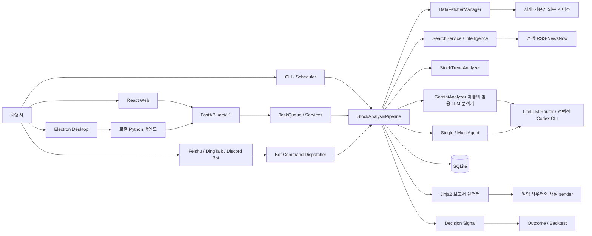
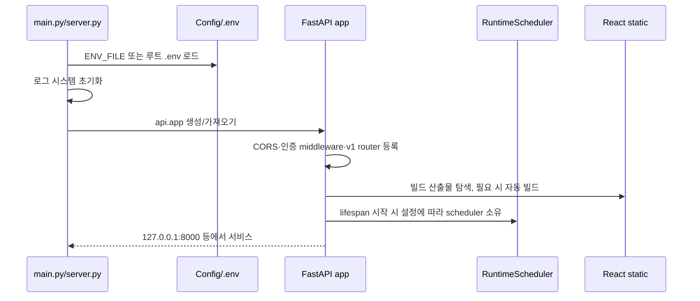
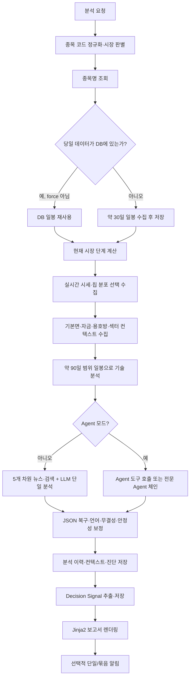
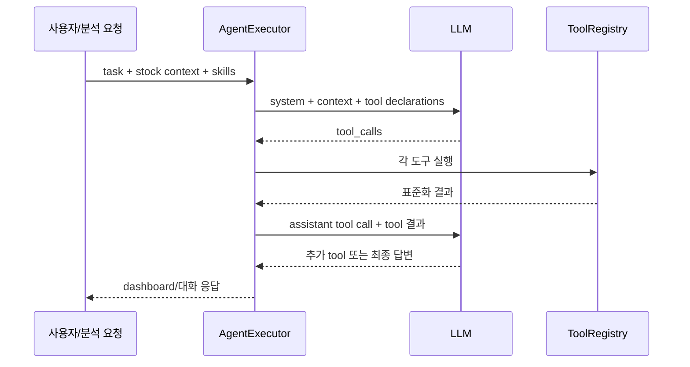
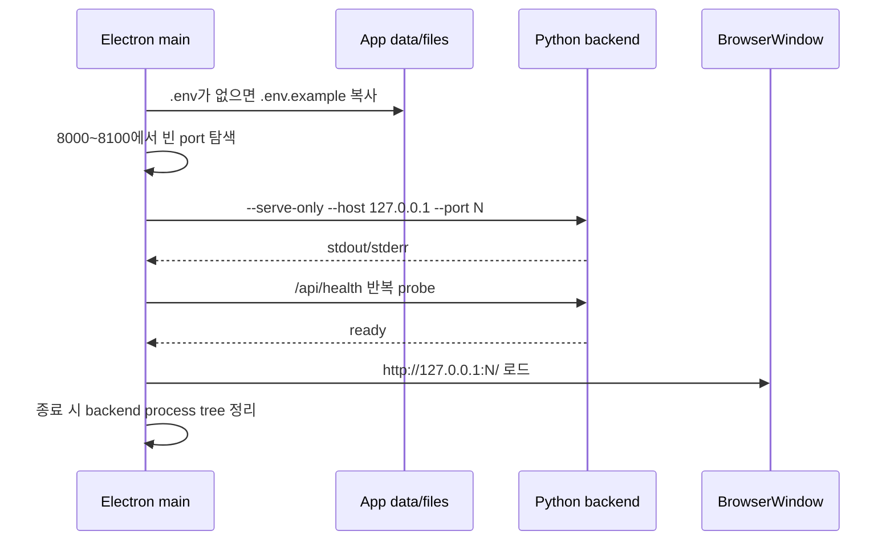
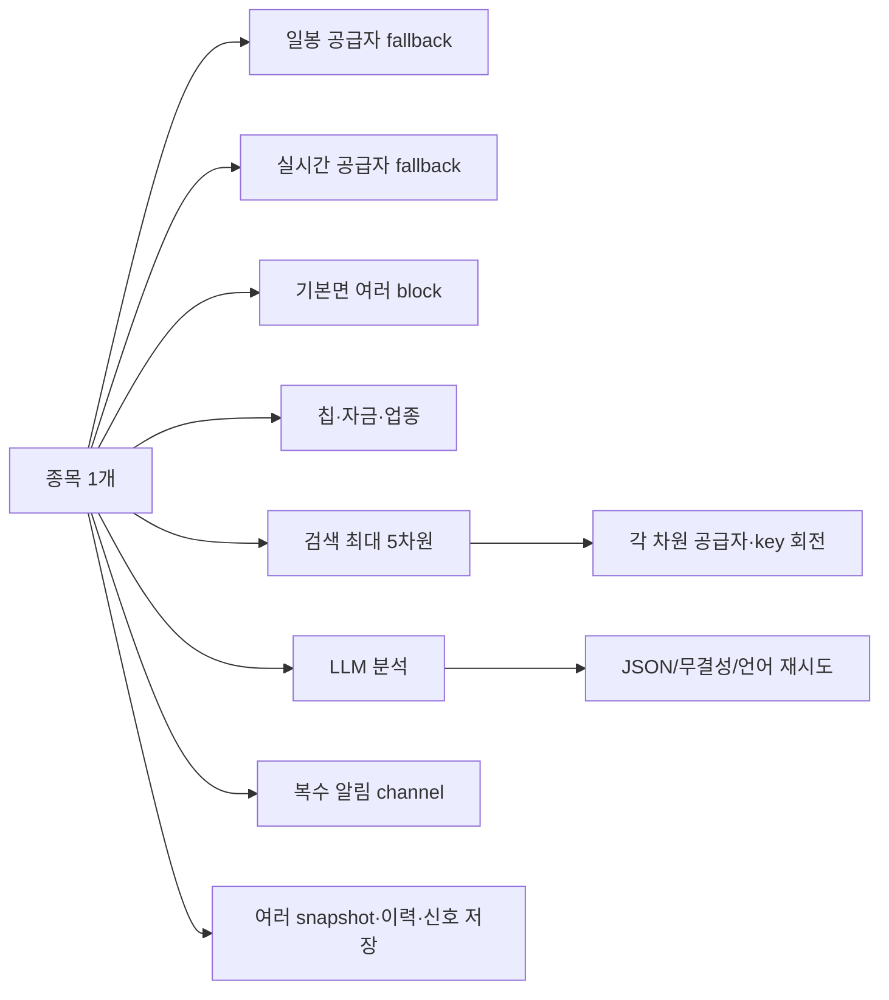
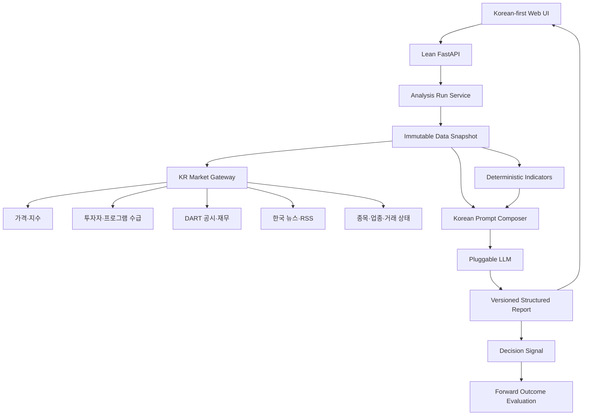

# Daily Stock Analysis 역기획서 v1

> 작성 기준일: 2026-08-09
>
> 분석 기준: 현재 저장소의 실행 가능한 코드, 설정 레지스트리, API 스키마, Web/Electron 클라이언트, 테스트와 배포 워크플로
> 목적: 중국 시장 중심의 현 시스템을 정확히 해체해 이해하고, 한국 시장 중심 제품을 처음부터 다시 설계할 때 재사용·교체·제거할 범위를 결정하기 위한 기준 문서

---

## 0. 문서 사용법

이 문서는 일반적인 제품 소개가 아니라 **구현을 역추적한 역기획서**다. 파일이나 기능이 존재한다는 사실과 실제 기본 실행 경로에서 사용된다는 사실을 구분한다.

| 표기 | 의미 |
| --- | --- |
| **기본 연결** | 별도 기능 플래그 없이 일반 실행 경로에서 사용된다. 단, 외부 키가 필요한 기능은 키가 있을 때만 실데이터를 얻는다. |
| **조건부 연결** | 설정, 키, 실행 모드 또는 요청 파라미터가 있을 때만 활성화된다. |
| **부분 지원** | 코드와 API는 있으나 시장·데이터·UI 또는 하류 연결이 제한적이다. |
| **중국 시장 전용** | A주 구조와 중국 공급자 데이터에 의미가 묶여 있어 한국 시장에 그대로 적용하면 안 된다. |
| **예약/미완성** | 설정이나 데이터 구조는 있으나 제품 흐름이 완결되지 않았거나 명시적으로 예약 상태다. |

중국어 원문에 있던 개념은 가능한 한 한국어로 번역했다. 다만 API 필드, 환경 변수, 클래스·함수명, 종목 코드와 공급자 고유명은 코드 계약이므로 원문 표기를 유지한다.

### 0.1 구성 안내

| 범위 | 내용 |
| --- | --- |
| 1~4장 | 제품 성격, 저장소 규모, 전체 아키텍처, 실행 모드 |
| 5~13장 | 종목 분석 pipeline, 데이터 공급자, 기술 지표, 뉴스, LLM, Prompt, Agent, 시장 복기, 보고서 |
| 14~20장 | SQLite, 의사결정 신호, 백테스트, 포트폴리오, 이벤트 알림, 전송 채널, AlphaSift |
| 21~28장 | REST API, Web UI, 디자인·UX, 인증, Bot, Electron, 스케줄, 배포·CI |
| 29~31장 | 설정 체계, dependency와 무거움의 원인, 실제 연결 상태 |
| 32~37장 | 한국 시장 중심 신규 구조, 단계별 로드맵, 유지·교체·제거 판단, 검증 전략 |
| 부록 A~E | 파일 탐색 지도, 런타임 상태 저장 위치, 문서 경계, LLM 호출 목록, 환경 변수 전체 색인 |

---

## 1. 한눈에 보는 결론

### 1.1 이 프로젝트의 정체

이 프로젝트는 단순한 “종목 하나를 LLM으로 분석하는 프로그램”이 아니다. 실제로는 다음 제품군이 하나의 Python 백엔드와 SQLite 저장소를 공유하는 **다중 채널 주식 분석 플랫폼**에 가깝다.

1. CLI 단일·일괄 종목 분석
2. A주·홍콩·미국 중심 시장 복기
3. FastAPI 서버와 React Web UI
4. Electron 데스크톱 패키지
5. Feishu·DingTalk·Discord 대화형 Bot
6. 13종 이상의 정적 알림 채널
7. 스케줄 분석과 이벤트 알림 모니터
8. 포트폴리오 원장·평가·위험 분석
9. 분석 결과 기반 의사결정 신호와 사후 성과 평가
10. 과거 분석 백테스트
11. AlphaSift 기반 중국 시장 종목 선별
12. RSS·Atom·NewsNow 기반 영속 인텔리전스 수집
13. LiteLLM 기반 다중 LLM 공급자·모델 라우팅과 사용량 추적
14. 단일 Agent 및 다중 전문 Agent 분석

따라서 현재 체감되는 무거움은 우연이 아니다. 이 저장소는 데이터 수집기, 분석 엔진, 업무 서비스, API, Web, Desktop, Bot, 배포를 한 저장소에서 모두 제공하며 `requirements.txt`도 기능별 선택 설치가 아닌 단일 묶음이다.

### 1.2 중국 시장 중심성이 박혀 있는 층

중국 시장 중심성은 번역 문자열보다 더 깊은 곳에 있다.

- 기본 종목 코드가 6자리 A주 코드다.
- 기본 시세 우선순위가 Efinance·Tencent·AkShare·Pytdx·Baostock다.
- 칩 분포, 주력 자금 흐름, 용호방, 상한가 풀, 테마·개념 섹터 같은 A주 전용 데이터가 분석 가치 판단에 들어간다.
- 기본 기술 전략이 “MA5 > MA10 > MA20, 괴리율 5% 이상 추격 금지, 거래량 축소 조정 선호”라는 중국 단기 추세 매매 철학을 중심으로 구성되어 있다.
- 시장 복기는 A주·미국·홍콩 프로필만 있으며 한국 시장 프로필은 없다.
- AlphaSift 화면은 시장 선택 값이 사실상 `cn` 하나다.
- NewsNow 기본 소스와 검색어 상당수가 중국 금융 매체와 A주 어휘를 사용한다.
- 포트폴리오 집계 기준 통화와 일부 내부 변수는 CNY 관점이 남아 있다.

한국 종목 `.KS`·`.KQ`는 현재 YFinance 일봉·시세·일부 기본면 경로를 타는 **제한 지원**이다. 한국 거래소 제도, 공시, 투자자별 수급, 장 구분, 업종 지수, ETF 특성까지 한국형으로 모델링된 것은 아니다.

### 1.3 재구축 시 권장 판단

| 영역 | 판단 | 이유 |
| --- | --- | --- |
| React UI 셸·디자인 토큰·공통 컴포넌트 | **적극 재사용** | 반응형 내비게이션, 카드, Drawer, 오류·빈 상태, 테마, 언어 전환 구조가 잘 정리되어 있다. |
| FastAPI 서비스/API 분리 방식 | **선별 재사용** | 기능 경계와 스키마는 참고 가치가 크지만 API 수가 많아 한국형 MVP에는 축소가 필요하다. |
| SQLite repository와 분석 이력 | **재설계 후 재사용** | 로컬 단일 사용자 제품에는 적합하나 시장·통화·신호 계약을 한국형으로 정리해야 한다. |
| LLM 라우터·구조화 출력·언어 검증 | **재사용 가치 높음** | 모델 교체, fallback, JSON 복구, 사용량 기록, 한국어 강제 기능이 유용하다. |
| 데이터 공급자 manager/failover 개념 | **인터페이스만 재사용** | 개념은 좋지만 구현 공급자와 지표 의미가 중국 시장 중심이다. |
| 기술 분석 점수 | **참고만 하고 재설계** | 고정 점수와 중국 단기 추세 철학이 강하며 검증된 한국 시장 알파로 볼 수 없다. |
| 칩·용호방·A주 주력 자금 | **제거 또는 한국형 지표로 교체** | 한국 시장에 동일한 의미의 데이터가 없거나 제도적 의미가 다르다. |
| AlphaSift 중국 종목 선별 | **초기 범위에서 제거** | 설치·데이터·스냅샷·LLM 의존성이 크고 한국 시장으로 바로 전환되지 않는다. |
| 알림 sender 모듈 | **필요 채널만 선택 재사용** | Telegram·Slack·Discord·이메일 등은 유용하지만 중국 전용 채널을 모두 설치할 필요는 없다. |
| Bot·Desktop·Actions | **MVP 이후 단계적 도입** | 핵심 분석이 안정되기 전에 유지하면 설치·운영 표면이 지나치게 커진다. |

---

## 2. 저장소 규모와 구성

현재 저장소에는 가상환경과 외부 패키지를 제외해도 Python 파일이 약 460개 있으며, 주요 제품 코드 규모는 다음과 같다.

| 경로 | 역할 | 관찰된 규모 |
| --- | --- | ---: |
| `src/` | 분석, LLM, 저장소, 서비스, Agent, 알림 | 368개 파일, 약 10 MB |
| `api/` | FastAPI 앱, middleware, v1 endpoint/schema | 96개 파일, 약 1.1 MB |
| `data_provider/` | 시세·시장·기본면 공급자와 fallback | 49개 파일, 약 1.9 MB |
| `bot/` | 명령 dispatcher와 Bot 플랫폼 어댑터 | 37개 파일, 약 0.35 MB |
| `tests/` | 백엔드 단위·통합·네트워크 테스트 | 226개 파일, 약 5 MB |
| `apps/dsa-web/src/` | React Web 제품 코드 | 252개 파일, 약 2.6 MB |
| `apps/dsa-desktop/` | Electron 실행·업데이트·패키징 | 단일 대형 `main.js`와 테스트 중심 |

### 2.1 상위 디렉터리 역할

```text
daily_stock_analysis/
├─ main.py                    CLI·스케줄·Web 동시 실행의 최상위 진입점
├─ server.py                  ASGI/FastAPI 전용 진입점
├─ webui.py                   Web 전용 호환 진입점
├─ src/
│  ├─ core/                   분석 파이프라인, 시장 복기, 거래일, 백테스트
│  ├─ services/               업무 서비스 계층
│  ├─ repositories/           SQLite 접근 계층
│  ├─ schemas/                내부 구조화 계약
│  ├─ agent/                  도구 호출 Agent와 전문 Agent
│  ├─ llm/                    생성 백엔드·오류·캐시·사용량 보조
│  └─ notification_sender/    채널별 알림 전송기
├─ data_provider/             외부 시장 데이터 어댑터와 통합 manager
├─ api/v1/                    REST/SSE API
├─ apps/dsa-web/              React 19 + TypeScript + Vite Web UI
├─ apps/dsa-desktop/          Electron 데스크톱 래퍼
├─ bot/                       Feishu·DingTalk·Discord Bot
├─ strategies/                15개 YAML 전략 skill
├─ templates/                 Jinja2 보고서 템플릿
├─ data/                      SQLite와 런타임 데이터
├─ reports/                   Markdown 보고서 파일
├─ scripts/                   CI·빌드·데스크톱 패키징 스크립트
├─ docker/                    다단계 Docker 이미지와 compose
└─ .github/workflows/         CI·일일 분석·릴리스·이미지 배포
```

---

## 3. 전체 시스템 아키텍처



### 3.1 계층별 책임

| 계층 | 핵심 모듈 | 책임 |
| --- | --- | --- |
| 진입점 | `main.py`, `server.py`, `webui.py` | 환경 로드, 로그 초기화, CLI 옵션, 서버·스케줄·분석 모드 선택 |
| API | `api/app.py`, `api/v1/` | 인증, 요청 검증, 업무 서비스 호출, SSE, React 정적 파일 제공 |
| 업무 서비스 | `src/services/` | 분석 작업, 이력, 포트폴리오, 알림, 설정, 사용량, 인텔리전스 |
| 도메인/파이프라인 | `src/core/pipeline.py`, `src/stock_analyzer.py` | 데이터 수집부터 분석·저장·알림까지 오케스트레이션 |
| 외부 데이터 | `data_provider/`, `src/search_service.py` | 공급자별 요청, 표준화, 캐시, timeout, failover |
| AI | `src/analyzer.py`, `src/agent/`, `src/llm/` | 프롬프트, 모델 라우팅, 도구 호출, 구조화 출력, 재시도 |
| 영속화 | `src/storage.py`, `src/repositories/` | SQLite 스키마, 이력·시세·포트폴리오·사용량·알림 저장 |
| 표현 | `templates/`, `src/services/report_renderer.py` | 분석 결과를 Markdown/채널별 형식으로 렌더링 |
| 클라이언트 | `apps/dsa-web/`, `apps/dsa-desktop/`, `bot/` | 브라우저, 데스크톱, 대화형 채널 UX |

---

## 4. 실행 모드와 시작 흐름

### 4.1 주요 명령

| 명령 | 동작 |
| --- | --- |
| `python main.py` | 기본 종목 목록 또는 지정 종목 분석, 설정에 따라 시장 복기·알림 수행 |
| `python main.py --stocks ...` | 요청한 종목만 분석 |
| `python main.py --market-review` | 종목 분석 없이 시장 복기 실행 |
| `python main.py --schedule` | 설정 시각마다 분석하고 선택적으로 이벤트 알림 monitor 실행 |
| `python main.py --serve` | Web/API를 띄우면서 스케줄 또는 분석도 함께 운용할 수 있는 모드 |
| `python main.py --serve-only` | Web/API만 실행하고 자동 종목 분석은 시작하지 않음 |
| `uvicorn server:app ...` | ASGI 서버를 직접 실행 |
| `python main.py --backtest` | 저장된 분석 이력을 대상으로 백테스트 수행 |
| `python -m src.auth reset_password` | 로컬 관리자 암호 강제 재설정 |

`--webui`, `--webui-only`는 각각 `--serve`, `--serve-only`의 호환 별칭이다.

### 4.2 Web 서버 부팅



`--serve-only`도 API 모듈과 업무 서비스를 import하므로 “분석을 실행하지 않는다”와 “분석 의존 패키지를 설치하지 않아도 된다”는 같은 뜻이 아니다. 현재 단일 `requirements.txt`와 import graph 때문에 Web 전용 실행도 많은 패키지를 요구할 수 있다.

### 4.3 작업 큐

`src/services/task_queue.py`는 API 비동기 분석의 중앙 작업 큐다.

- 기본 최대 동시 실행 수는 3이다.
- `pending → processing → completed/failed` 상태와 진행률을 관리한다.
- 동일 종목에 완료되지 않은 작업이 있으면 중복 제출을 거부하고 기존 `task_id`를 돌려준다.
- 단일·배치 제출을 지원한다.
- SSE 구독자에게 작업 목록·진행률·완료 이벤트를 전달한다.
- 오래된 완료 작업을 보존 기간 뒤 정리한다.
- 프로세스 메모리 작업 상태와 DB에 저장된 최종 분석 이력은 별개다.

이 구분 때문에 서버 재시작 뒤에는 작업 큐의 진행 상태는 사라져도 완성된 `analysis_history`는 남을 수 있다.

---

## 5. 종목 분석 전체 흐름

### 5.1 요청 계약

`POST /api/v1/analysis/analyze`의 핵심 입력은 다음과 같다.

| 필드 | 값/기본값 | 의미 |
| --- | --- | --- |
| `stock_code` | 단일 코드 | `stock_codes`와 둘 중 하나 |
| `stock_codes` | 코드 배열 | 배치 분석 |
| `report_type` | `detailed` | `simple`, `detailed`, `full`, `brief` |
| `force_refresh` | `false` | 로컬 최신 데이터 캐시를 무시하고 다시 수집 |
| `async_mode` | `false` | 즉시 응답 대신 작업 큐에 제출 |
| `analysis_phase` | `auto` | `premarket`, `intraday`, `postmarket` 강제 가능 |
| `stock_name` | 선택 | 자동완성에서 확정한 표시명 |
| `original_query` | 선택 | 사용자가 실제 입력한 이름·초성·코드 |
| `selection_source` | 선택 | `manual`, `autocomplete`, `import`, `image` 등 |
| `notify` | `true` | 분석 완료 뒤 설정된 채널로 전송할지 여부 |
| `report_language` | 전역값 | `zh`, `en`, `ko`; 요청별 override |
| `skills` | 선택 | 이번 분석에 적용할 전략 skill ID, 구 필드 `strategies`도 허용 |

### 5.2 파이프라인 단계



### 5.3 단계별 세부 동작

#### 1) 종목과 시장 식별

- A주: `600519`, `000001`, `SH600519`, `SZ000001` 등을 6자리 중심으로 정규화한다.
- 홍콩: `HK00700`, `1810.HK`를 `HK` + 5자리 형태로 정규화한다.
- 미국: `AAPL`, `MSFT`, `SPX` 등 영문 ticker·index alias를 구분한다.
- 일본: `7203.T`를 유지한다.
- 한국: `005930.KS`, `035720.KQ`를 유지한다.
- 시장은 `cn`, `hk`, `us`, `jp`, `kr` 중 하나로 분기한다.

#### 2) 일봉 확보와 저장

- 먼저 종목명과 유효 목표 거래일을 구한다.
- 강제 갱신이 아니고 DB에 해당 거래일까지 데이터가 있으면 재사용한다.
- 없으면 기본적으로 최근 30일 일봉을 `DataFetcherManager`에서 가져온다.
- 공급자 DataFrame을 날짜·시가·고가·저가·종가·거래량·거래대금·등락률 등 공통 컬럼으로 정규화한다.
- `stock_daily`에 source와 이동평균을 함께 저장한다.

#### 3) 시장 단계와 일일 시장 컨텍스트

시각과 거래 캘린더를 사용해 `premarket`, `intraday`, `lunch_break`, `closing_auction`, `postmarket`, `non_trading`, `unknown` 중 하나를 만든다. API 입력은 간단히 `auto/premarket/intraday/postmarket`만 받지만 내부 표현은 더 세분화되어 있다.

`DAILY_MARKET_CONTEXT_ENABLED=true`이면 같은 날 시장 복기 이력을 재사용하거나 시장 복기를 생성해 다음을 개별 종목 prompt에 넣는다.

- 시장 분위기와 저민감도 요약
- 위험 태그
- 권장 최대 포지션 비율
- 데이터 시점과 출처

#### 4) 실시간·칩 데이터

- `ENABLE_REALTIME_QUOTE=true`이면 실시간 호가를 요청한다.
- 실패하면 가장 최근 일봉 종가를 현재가로 사용한다.
- `ENABLE_REALTIME_TECHNICAL_INDICATORS=true`이면 실시간 bar를 일봉 끝에 합쳐 지표를 다시 계산할 수 있다.
- `ENABLE_CHIP_DISTRIBUTION=true`이고 공급자가 지원하면 수익 보유 비율, 평균 원가, 70%·90% 칩 집중도를 가져온다.
- 칩 데이터는 사실상 중국 시장 중심이며 한국 종목에서는 “지원하지 않음”으로 처리하는 것이 올바르다.

#### 5) 기본면 컨텍스트

`ENABLE_FUNDAMENTAL_PIPELINE=true`이면 제한 시간 안에서 다음 블록을 모은다.

- 최근 재무보고: 매출, 지배주주 순이익, 영업현금흐름, ROE
- 배당: 최근 12개월 주당 현금배당, TTM 배당수익률, 배당 이벤트 수
- 종목 자금 흐름: 당일·5일·10일 주력 순유입
- 업종·테마 자금 순위
- 용호방 거래
- 소속 업종·테마

중국 종목은 AkShare 계열 adapter를, 미국·홍콩·일본·한국은 YFinance fundamental adapter를 사용한다. 후자의 중국 전용 블록은 억지로 추정하지 않고 `not_supported`로 남긴다. 결과는 coverage와 source chain을 포함해 `fundamental_snapshot`에 저장된다.

#### 6) 결정론적 기술 분석

약 90일 달력 범위, 통상 60거래일 안팎의 OHLCV로 `StockTrendAnalyzer`가 LLM 이전에 점수와 신호를 계산한다. 자세한 공식은 7장에 정리한다.

#### 7) 뉴스·외부 정보

전통 분석 경로는 최대 5개 검색 차원을 실행한다. 중국 종목은 공시 차원이 추가된 6개 후보 중 제한 수만 선택되고, 해외 종목은 다른 영어 질의를 사용한다. 저장된 RSS/NewsNow 인텔리전스와 미국 종목용 소셜 심리도 조건부로 합친다.

#### 8) LLM 또는 Agent

- 기본 전통 경로: 구조화된 컨텍스트와 검색 결과를 하나의 큰 user prompt로 만들고 범용 분석기를 한 번 호출한다.
- Agent 경로: LLM이 도구를 선택해 반복 호출하거나, 기술·정보·위험·의사결정 전문 Agent가 순차로 의견을 만든다.

#### 9) 사후 보정

- 잘못된 JSON을 추출·복구한다.
- 필수 필드가 없으면 한 차례 보완 prompt를 보낼 수 있다.
- `REPORT_LANGUAGE=ko`인데 중국어가 지배적인 결과면 전체 JSON 재생성을 한 번 요청한다.
- 그래도 언어 계약을 위반하면 잘못된 언어 보고서를 조용히 저장하지 않고 실패 결과로 바꾼다.
- 단일 일간 등락만으로 매수·매도 신호가 뒤집히지 않도록 지지·저항·자금 흐름·위험을 사용한 안정성 보정을 적용한다.

#### 10) 저장과 하류 처리

- `analysis_history`에 원본 구조화 결과, 요약, 점수, 조언, 뉴스, 컨텍스트 snapshot을 저장한다.
- 구조화 결과에서 `decision_signals` 레코드를 추출한다.
- 보고서 템플릿으로 Markdown을 만든다.
- 요청과 전역 설정에 따라 알림을 보낸다.
- 채널 실패는 원칙적으로 분석 자체를 실패시키지 않는 fail-open이다.

---

## 6. 데이터 공급자와 fallback

### 6.1 통합 manager의 역할

`DataFetcherManager`는 공급자를 우선순위로 정렬하고 다음 공통 인터페이스를 제공한다.

- 일봉
- 실시간 시세
- 종목명
- 주요 지수
- 시장 상승·하락·보합 종목 수와 거래대금
- 업종·개념 순위
- 인기 종목과 상한가 풀
- 칩 분포
- 기본면·자금 흐름·용호방·소속 업종

공급자 단위 호출은 manager가 가진 lock으로 직렬화할 수 있고, 일봉 공급자는 3회 실패 후 300초 냉각하는 circuit breaker를 사용한다. 실패 이유, latency, fallback 대상과 레코드 수는 실행 진단에 기록된다.

### 6.2 시장별 일봉 지원 매핑

| 공급자 | 중국 | 홍콩 | 미국 | 일본 | 한국 | 기본 활성 조건 |
| --- | :---: | :---: | :---: | :---: | :---: | --- |
| Efinance | O | - | - | - | - | 항상 인스턴스 생성 |
| Tencent | O | - | - | - | - | 항상 인스턴스 생성 |
| AkShare | O | O | - | - | - | 항상 인스턴스 생성 |
| Tushare | O | O | - | - | - | `TUSHARE_TOKEN`이 있을 때 |
| Pytdx | O | - | - | - | - | 항상 생성, 접속 가능성은 런타임 확인 |
| Baostock | O | - | - | - | - | 항상 인스턴스 생성 |
| YFinance | O | O | O | O | O | 항상 인스턴스 생성 |
| Longbridge | - | O | O | - | - | OAuth 또는 legacy 자격증명이 있을 때 |
| Finnhub | - | - | O | - | - | `FINNHUB_API_KEY`가 있을 때 |
| Alpha Vantage | - | - | O | - | - | `ALPHAVANTAGE_API_KEY`가 있을 때 |

### 6.3 시장별 실제 경로

#### 중국 A주

설정 priority로 정렬된 공급자를 차례로 시도한다. 기본 주석상 Efinance 0, AkShare 1, Pytdx 2, Baostock 3, YFinance 4이며 Tencent도 manager 목록에 포함된다. Tushare token이 있으면 Tushare 내부 priority가 올라갈 수 있다.

#### 미국

- 일반 기본 순서: Finnhub → Alpha Vantage → YFinance → Longbridge
- Longbridge 선호가 활성화된 일반 종목: Longbridge → Finnhub → Alpha Vantage → YFinance
- 미국 지수: YFinance → Finnhub

#### 홍콩

홍콩 지원 공급자만 남긴 뒤 priority 순으로 fallback한다. Longbridge 자격증명이 있으면 실시간·일봉 보강 경로에 참여한다.

#### 일본·한국

일봉 지원표상 YFinance만 남는다. 즉 현재 한국 종목 지원은 사실상 YFinance 단일 공급자 경로다. 한국형 제품으로 볼 때 가장 큰 단일 실패 지점이다.

### 6.4 공급자별 기능과 키 용도

| 서비스/모듈 | 무엇을 얻는가 | 키·설정 | 미설정/실패 시 |
| --- | --- | --- | --- |
| **Efinance** | East Money 기반 A주/ETF 일봉·실시간·지수·시장 통계·업종·기본 정보 | 키 없음, priority·timeout | 다음 공급자로 fallback |
| **Tencent** | Tencent 시세 인터페이스 기반 중국 종목 데이터 | 키 없음 | 다음 공급자로 fallback |
| **AkShare** | East Money·Sina·Tencent 등을 감싼 A/H 시세, 지수, 시장 통계, 섹터, 인기·상한가, 칩 | 키 없음 | 부분 기능별 fallback |
| **Tushare Pro** | A주/H주 일봉, 실시간, 종목명, 지수, 시장 통계, 업종, 칩 | `TUSHARE_TOKEN`; 일부 API는 포인트 등급 영향 | fetcher 자체를 생성하지 않음 |
| **Pytdx** | 통달신 서버 기반 A주 일봉·시세·종목명 | `PYTDX_HOST`, `PYTDX_PORT` | 자동 서버/다음 공급자 |
| **Baostock** | A주 일봉·종목 목록·이름 fallback | 키 없음 | 다음 공급자 |
| **YFinance** | 미국·홍콩·일본·한국 일봉·실시간 보조·지수·기본면·배당·재무 | 키 없음 | 해외 시장은 대체 경로가 제한될 수 있음 |
| **Finnhub** | 미국 일봉·실시간·종목명 | `FINNHUB_API_KEY` | 인스턴스 미생성 |
| **Alpha Vantage** | 미국 일봉·실시간·종목명 | `ALPHAVANTAGE_API_KEY` | 인스턴스 미생성 |
| **Longbridge(롱브리지)** | 미국·홍콩 시세, 일봉, 정적 종목 정보 | OAuth client/token cache 또는 app key/secret/access token | 인스턴스 미생성 |
| **TickFlow** | A주 시장 복기용 주요 지수·시장 통계 강화 | `TICKFLOW_API_KEY` | 일반 manager 자료 사용 |

### 6.5 Longbridge 설정이 많은 이유

Longbridge는 단순 REST 키 하나가 아니라 SDK 연결과 OAuth/legacy 인증을 모두 지원한다.

- `LONGBRIDGE_OAUTH_CLIENT_ID`: OAuth 앱 식별자
- `LONGBRIDGE_OAUTH_TOKEN_CACHE_B64`: 토큰 캐시를 base64 형태로 전달
- `LONGBRIDGE_APP_KEY`, `LONGBRIDGE_APP_SECRET`, `LONGBRIDGE_ACCESS_TOKEN`: 기존 SDK 자격증명 세트
- `LONGBRIDGE_HTTP_URL`, `LONGBRIDGE_QUOTE_WS_URL`, `LONGBRIDGE_TRADE_WS_URL`: endpoint override
- `LONGBRIDGE_REGION`: 접속 지역
- `LONGBRIDGE_STATIC_INFO_TTL_SECONDS`: 종목 정적 정보 cache TTL
- `LONGBRIDGE_CONNECTION_COOLDOWN_SECONDS`: 연결 실패 후 재시도 냉각
- `LONGBRIDGE_ENABLE_OVERNIGHT`: 미국 overnight 세션 사용
- `LONGBRIDGE_PUSH_CANDLESTICK_MODE`: push candle 모드
- `LONGBRIDGE_PRINT_QUOTE_PACKAGES`: 계정 quote package 진단 출력

한국형 MVP에서는 Longbridge가 핵심이 아니므로 이 설정군 전체를 선택 기능으로 격리할 수 있다.

---

## 7. 결정론적 기술 분석 로직

`src/stock_analyzer.py`는 LLM이 보기 전에 같은 데이터에 대해 항상 같은 결과를 내는 분석기다. 이 값은 prompt의 근거, 대시보드 fallback, 안정성 보정에 쓰인다.

### 7.1 계산 지표

| 지표 | 계산 |
| --- | --- |
| MA5·MA10·MA20 | 종가 단순이동평균 |
| MA60 | 60개 bar가 있으면 계산, 부족하면 MA20을 대체값으로 사용 |
| 괴리율 | `(현재가 - 이동평균) / 이동평균 × 100` |
| 거래량 비율 | 최신 거래량 / 직전 5일 평균 거래량 |
| MACD | DIF=`EMA12-EMA26`, DEA=`DIF의 EMA9`, 막대=`(DIF-DEA)×2` |
| RSI | 6·12·24 기간, Wilder 방식 `ewm(alpha=1/period)`; 판단은 RSI12 중심 |
| 지지 | 현재가가 MA5·MA10 근처이면서 평균 위에 있는지, MA20 위인지 |
| 저항 | 최근 20일 고가 중 현재가보다 높은 값 |

### 7.2 추세 분류

| 조건 | 상태 | 추세 강도 |
| --- | --- | ---: |
| `MA5 > MA10 > MA20`, 5일 전보다 MA5-MA20 간격 확대, 간격 5% 초과 | 강한 상승 정렬 | 90 |
| `MA5 > MA10 > MA20` | 상승 정렬 | 75 |
| `MA5 > MA10`, `MA10 ≤ MA20` | 약한 상승 | 55 |
| 평균선 혼조 | 횡보 | 50 |
| `MA5 < MA10`, `MA10 ≥ MA20` | 약한 하락 | 40 |
| `MA5 < MA10 < MA20` | 하락 정렬 | 25 |
| 하락 정렬이며 간격 확대·5% 초과 | 강한 하락 | 10 |

### 7.3 100점 점수표

| 구성 | 배점 | 핵심 규칙 |
| --- | ---: | --- |
| 추세 | 30 | 강한 상승 30, 상승 26, 약한 상승 18, 횡보 12, 약한 하락 8, 하락 4, 강한 하락 0 |
| MA5 괴리 | 20 | MA5 바로 아래 조정과 0~2% 위 구간을 높게 평가; 기본 임계치 초과 추격은 4점 |
| 거래량 | 15 | 거래량 축소 하락 15, 거래량 증가 상승 12, 보통 10, 거래량 축소 상승 6, 거래량 증가 하락 0 |
| 지지 | 10 | MA5 지지 5 + MA10 지지 5 |
| MACD | 15 | 0선 위 골든크로스 15, 골든크로스 12, 0선 상향 돌파 10, 상승 8, 하락 2, 하향·데드크로스 0 |
| RSI | 10 | 과매도 10, 강세 8, 중립 5, 약세 3, 과매수 0 |

강한 상승 추세이고 추세 강도가 70 이상이면 추격 금지 괴리 임계치를 `BIAS_THRESHOLD × 1.5`로 완화한다.

### 7.4 최종 기계 신호

| 조건 | 신호 |
| --- | --- |
| 75점 이상 + 상승/강한 상승 | 강한 매수 |
| 60점 이상 + 약한 상승 이상 | 매수 |
| 45점 이상 | 보유 |
| 30점 이상 | 대기 |
| 30점 미만 + 하락/강한 하락 | 강한 매도 |
| 그 외 | 매도 |

### 7.5 한국형 재설계 시 주의

이 점수는 구현된 휴리스틱이지 검증된 보편적 투자 모델이 아니다. 특히 “거래량 축소 하락=세력의 물량 털기/좋은 조정”, “RSI 과매도=최고 점수”, “MA60 부족 시 MA20 대체”는 한국 시장에서도 자동으로 타당하다고 볼 수 없다. 새 제품에서는 다음이 필요하다.

- 지표 계산과 매매 정책 분리
- 시장·종목군별 parameter versioning
- 수정주가와 corporate action 처리
- 거래정지·상하한가·VI·관리종목 상태 반영
- walk-forward 검증과 거래비용·세금 포함 평가
- 설명용 점수와 실제 신호 모델 분리

---

## 8. 검색·뉴스·영속 인텔리전스

### 8.1 두 종류의 정보 수집

프로젝트에는 서로 다른 두 정보 경로가 있다.

1. **요청 시 Web 검색**: `src/search_service.py`가 종목 분석 직전에 여러 검색 공급자를 호출한다.
2. **영속 인텔리전스**: `src/services/intelligence_service.py`가 RSS·Atom·NewsNow 소스를 등록·수집해 DB에 보관하고 이후 분석에 합친다.

둘을 구분하지 않으면 같은 뉴스를 검색과 feed에서 중복 소비하거나, “소스가 등록되어 있다”는 이유만으로 최신 수집이 된 것으로 오해할 수 있다.

### 8.2 Web 검색 공급자 순서

구성된 공급자만 목록에 들어가며 기본 삽입 순서는 다음과 같다.

1. Bocha
2. Tavily
3. Brave
4. SerpAPI
5. MiniMax
6. SearXNG
7. Anspire는 설정되면 목록 맨 앞에 삽입

공급자별 API key 배열을 지원해 quota나 오류 시 키를 회전한다. 결과는 제목·snippet·URL·source·발행일 중심으로 표준화하고, 캐시·동시 요청 합치기(single-flight), 날짜 필터, 광고·성인·스팸·저품질 필터, 종목 정체성 관련도 검사를 적용한다.

### 8.3 검색 서비스 키의 정확한 용도

| 설정 | 서비스 | 요청에 쓰이는 값 | 비고 |
| --- | --- | --- | --- |
| `ANSPIRE_API_KEYS` | Anspire Search | bearer key, query, `top_k`, 시작·종료 시각 | 검색용이다. 별도 설정으로 LLM gateway에도 Anspire를 쓸 수 있다. |
| `BOCHA_API_KEYS` | Bocha Web Search | bearer key, query, freshness, summary, count | 중국어 금융 검색과 AI 요약에 최적화된 경로 |
| `TAVILY_API_KEYS` | Tavily | query, search depth, topic/news, max results | 비교적 일반적인 AI 검색 API |
| `SERPAPI_API_KEYS` | SerpAPI | Google 검색 파라미터 | organic 결과를 정규화하고 일부 문서 본문을 추가 수집 |
| `BRAVE_API_KEYS` | Brave Search | query, count, 국가·언어 hint | 비중국 종목에 무조건 미국 locale을 강제하지 않도록 분기 |
| `MINIMAX_API_KEYS` | MiniMax Coding Plan Web Search | query와 구조화 검색 요청 | MiniMax LLM key와 역할이 다를 수 있음 |
| `SEARXNG_BASE_URLS` | 자체 SearXNG | instance URL | 키 없이 사설 metasearch 사용 가능 |
| `SEARXNG_PUBLIC_INSTANCES_ENABLED` | 공개 SearXNG discovery | searx.space에서 후보 탐색 | 불안정성과 개인정보·운영 위험이 있어 제품 기본값으로는 신중해야 함 |

### 8.4 종목 분석 검색 차원

해외 종목은 다음 질의 차원을 만든다.

| 차원 | 목적 | 예시 의미 |
| --- | --- | --- |
| `latest_news` | 최근 중요 뉴스 | 종목명 + latest news |
| `market_analysis` | 기관·시장 분석 | analyst, target, outlook |
| `risk_check` | 규제·소송·내부자 매도 등 | risk, lawsuit, insider selling |
| `earnings` | 실적·매출·이익·guidance | ETF면 구성 지수·보유 자산 관점으로 변경 |
| `industry` | 산업·경쟁사·점유율 전망 | ETF면 테마·산업 노출 관점으로 변경 |

중국 종목은 여기에 `announcements`가 들어가고 중국어 질의로 바뀐다. pipeline은 기본적으로 최대 검색 수를 5로 제한하므로 후보 차원 전체가 항상 모두 호출되는 것은 아니다. 차원당 목표 결과는 대략 3개이며 공급자 호출 사이에 짧은 지연을 둔다.

- 최신 뉴스·위험·공시는 엄격한 최신성 필터를 쓴다.
- 시장 분석·실적은 더 긴 기간을 허용한다.
- 발행일이 없거나 최신 기간 밖인 뉴스는 LLM에게 무시하도록 명시한다.
- 검색 결과는 `news_intel`에 query, provider, 제목, snippet, URL, source, published_at과 요청 컨텍스트를 저장할 수 있다.

### 8.5 미국 소셜 심리

`SOCIAL_SENTIMENT_API_KEY`가 있으면 미국 종목에 한해 `SOCIAL_SENTIMENT_API_URL`의 외부 API를 호출해 Reddit, X, Polymarket 계열 신호를 보강한다. 코드 주석상 무료 월 250회와 같은 제한을 전제로 캐시와 fail-open을 사용한다. 한국 시장에는 연결되지 않는다.

### 8.6 RSS·Atom·NewsNow 인텔리전스

`/api/v1/intelligence` API는 다음을 제공한다.

- 소스 생성·목록
- 내장 template 목록
- template로 소스 생성
- 기본 소스 일괄 생성
- 저장 전 dry-run 테스트
- 특정 소스 또는 활성 소스 전체 수집
- 저장된 item 조회

지원 형식은 `rss`, `atom`, `newsnow`, 범위는 `symbol`, `market`, `sector`, 시장 값은 `cn`, `hk`, `us`, `jp`, `kr`, `global`이다.

내장 소스는 다음과 같다.

| Template | 시장 | 실제 목적 |
| --- | --- | --- |
| SEC Latest Filings | 미국 | SEC 공식 보도자료 RSS 증거 |
| HKEX Market News | 홍콩 | 홍콩거래소 공개 뉴스, 활성 전 테스트 권고 |
| MarketWatch Top Stories | 글로벌 | 일반 시장 상위 뉴스 |
| NewsNow 차이롄서 인기 | 중국 | A주 시장·테마 인기 뉴스 |
| NewsNow Xueqiu 인기 종목 | 중국 | A/H/미국 종목 개인 관심도 |
| NewsNow WallstreetCN 속보 | 중국 | 거시·상품·시장 이벤트 |
| NewsNow Jin10 | 글로벌 | 실시간 거시·외부 시장 이벤트 |
| NewsNow Gelonghui | 홍콩 | 홍콩·중국계 해외 종목 이벤트 |

보안상 feed URL은 DNS를 검증해 loopback·private IP 접근을 막고, redirect 수와 응답 크기(2 MB)를 제한한다. 이 SSRF 보호 구조는 한국형 DART/RSS 수집기에서도 재사용 가치가 높다.

---

## 9. LLM 계층과 외부 모델 서비스

### 9.1 이름과 실제 구현의 차이

핵심 클래스 이름은 `GeminiAnalyzer`지만 현재는 Gemini 전용이 아니다. `LiteLLM`을 통해 다양한 OpenAI 호환·Anthropic·Gemini 계열 모델을 호출하고 fallback한다. 이름은 역사적 흔적이다.

### 9.2 생성 백엔드

| 설정 | 의미 |
| --- | --- |
| `GENERATION_BACKEND=litellm` | 기본. 네트워크 LLM을 LiteLLM으로 호출 |
| `GENERATION_BACKEND=codex_cli` | 실험적 로컬 CLI subprocess 생성 경로 |
| `GENERATION_FALLBACK_BACKEND` | 주 backend가 fallback 가능한 오류를 낼 때 대체 backend |
| `GENERATION_BACKEND_TIMEOUT_SECONDS` | backend 전체 실행 제한 |
| `GENERATION_BACKEND_MAX_OUTPUT_BYTES` | subprocess/생성 결과 크기 제한 |
| `GENERATION_BACKEND_MAX_CONCURRENCY` | 생성 전체 동시성 제한 |
| `LOCAL_CLI_BACKEND_MAX_CONCURRENCY` | CLI backend 별도 동시성 제한 |
| `AGENT_GENERATION_BACKEND` | Agent 도구 호출용 backend; `auto` 또는 `litellm` 중심이며 Codex CLI는 tool calling을 대신하지 못함 |

### 9.3 LLM 공급자 키

다음 키들은 모두 필수인 것이 아니다. 사용할 channel·model에 맞는 것 하나 이상만 필요하다.

| 공급자/브랜드 | 일반 설정 | 쓰임 |
| --- | --- | --- |
| Gemini | `GEMINI_API_KEY`, `LLM_GEMINI_API_KEY(S)`, `LLM_GEMINI_MODELS` | Google Gemini 계열 생성 |
| DeepSeek | `DEEPSEEK_API_KEY`, `LLM_DEEPSEEK_*` | DeepSeek chat/reasoning 모델 |
| OpenAI/호환 | `OPENAI_API_KEY`, `OPENAI_BASE_URL`, `LLM_OPENAI_*` | OpenAI 또는 같은 API 형식의 gateway |
| Anthropic | `ANTHROPIC_API_KEY`, `LLM_ANTHROPIC_*` | Claude 계열 |
| AIHubmix | `AIHUBMIX_KEY`, `LLM_AIHUBMIX_*` | 여러 모델을 중계하는 OpenAI 호환 gateway |
| Anspire LLM | `ANSPIRE_LLM_ENABLED`, `ANSPIRE_LLM_MODEL`, `ANSPIRE_LLM_BASE_URL` 또는 `LLM_ANSPIRE_*` | Anspire의 OpenAI 호환 생성 경로; 검색 key와 겸용 구성 가능 |
| Ollama | `OLLAMA_API_BASE`, `LLM_OLLAMA_BASE_URL`, `LLM_OLLAMA_MODELS` | 로컬/사설 Ollama 서버 |
| Moonshot/Kimi | `LLM_MOONSHOT_*` | Moonshot 계열 |
| DashScope/Qwen | `LLM_DASHSCOPE_*` | Alibaba Qwen 계열 |
| Zhipu GLM | `LLM_ZHIPU_*` | Zhipu 모델 |
| MiniMax | `LLM_MINIMAX_*` | MiniMax 생성 모델 |
| MiMo | `LLM_MIMO_*` | MiMo 호환 endpoint |
| Volcengine/Doubao | `LLM_VOLCENGINE_*` | Volcengine endpoint/model |
| SiliconFlow | `LLM_SILICONFLOW_*` | 다중 오픈모델 gateway |
| OpenRouter | `LLM_OPENROUTER_*` | OpenRouter 다중 모델 gateway |

### 9.4 동적 channel 계약

`LLM_CHANNELS=deepseek,openai,...`처럼 channel ID 목록을 지정하고 channel마다 다음 패턴을 쓴다.

```text
LLM_<CHANNEL>_PROTOCOL
LLM_<CHANNEL>_BASE_URL
LLM_<CHANNEL>_API_KEY
LLM_<CHANNEL>_MODELS
```

- `PROTOCOL`은 공급자 호출 형식을 결정한다.
- `MODELS`는 쉼표 구분 모델 목록이다.
- model은 보통 `provider/model-name` 형태로 `LITELLM_MODEL` 또는 `AGENT_LITELLM_MODEL`에서 선택한다.
- `LITELLM_CONFIG`를 사용하면 YAML router 정의도 읽을 수 있다.
- 설정 화면은 channel 연결, 모델 목록 discovery, 텍스트·JSON·tool·stream·vision capability를 각각 시험할 수 있다.

### 9.5 모델 호출 파라미터

전통 분석 호출은 내부적으로 다음 구조를 만든다.

```json
{
  "model": "LITELLM_MODEL 또는 fallback 후보",
  "messages": [
    {"role": "system", "content": "분석 역할 + JSON 계약 + 언어 계약"},
    {"role": "user", "content": "시세·기술·기본면·뉴스·시장 컨텍스트"}
  ],
  "temperature": "LLM_TEMPERATURE를 모델 특성에 맞게 정규화",
  "max_tokens": "요청값 또는 기본 8192",
  "timeout": "LLM_TIMEOUT_SEC",
  "stream": "Web/Agent 흐름에 따라 선택"
}
```

Agent 호출은 여기에 OpenAI 형식의 `tools` 선언을 붙인다. reasoning 모델은 provider별 `extra_body`를 추가할 수 있고, 지원하지 않는 temperature 등의 파라미터 오류가 나면 제거·교정해 재시도한다.

### 9.6 라우팅과 fallback

1. `LITELLM_MODEL`을 우선한다.
2. `LITELLM_FALLBACK_MODELS` 또는 channel/YAML router 후보를 순회한다.
3. channel router가 있으면 복수 key load balancing과 retry를 router에 맡긴다.
4. legacy 설정이면 직접 `litellm.completion()`과 내부 fallback을 섞어 사용한다.
5. 모델별 실패·검증 실패를 수집하고 모두 실패하면 구조화된 오류를 만든다.

`LLM_USAGE_HMAC_SECRET`과 version은 prompt 원문을 저장하지 않고 message fingerprint를 남기는 데 쓰인다. `LLM_PROMPT_CACHE_TELEMETRY_ENABLED`, `...HINTS_ENABLED`, `...DIAGNOSTICS_LEVEL`은 provider prompt cache가 실제로 적용됐는지 진단한다.

---

## 10. 전통 분석 Prompt의 정확한 구조

### 10.1 System prompt

전통 분석에는 두 system prompt 계열이 있다.

- **legacy 기본 prompt**: 암묵적으로 기본 `bull_trend`만 쓸 때 적용. MA 상승 정렬·괴리율·거래량·칩을 강하게 강조한다.
- **skill-aware prompt**: 명시적 전략 선택이나 복수 전략에 적용. 활성 skill의 정책·지시문을 삽입한다.

공통 역할은 시장별 투자 분석가이며 출력은 “의사결정 대시보드” JSON이다. system prompt에는 다음 안정성 원칙이 포함된다.

- 하루 가격·점수 하나만으로 결론을 뒤집지 않는다.
- 현재 위치, 거래량, 칩, 자금 흐름과 위험을 함께 본다.
- 지지·저항 중간이고 자금이 중립이면 보유/관망을 우선한다.
- 매수는 지지 확인 또는 유효 돌파와 자금 확인이 있을 때 강화한다.
- 매도는 지지 붕괴, 자금 이탈 또는 중대한 위험이 있을 때 강화한다.
- 데이터가 적거나 오래됐으면 confidence를 높이지 않는다.

### 10.2 User prompt에 주입되는 데이터

| 구역 | 주입 값 |
| --- | --- |
| 종목 식별 | code, 조회된 종목명, 시장별 분석 지침 |
| 장 상태 | 시장, 현지 시각, 거래일, 장 단계, 현재 개장 여부 |
| 일일 시장 | 같은 날 시장 복기 요약, 위험 태그, position cap |
| 컨텍스트 팩 | 데이터 가용성·신선도·출처·결손을 압축한 요약 |
| 일봉 | 날짜, OHLC, 등락, 거래량, MA5·10·20 |
| 실시간 | 현재가, 등락률, 거래량 비율, 회전율, PE, PB, 시총, 60일 등락 |
| 재무·배당 | 보고일, 매출, 지배순이익, 영업현금흐름, ROE, TTM 배당 |
| 자금 | 당일·5일·10일 주력 순유입, 상·하위 업종 |
| 칩 | 수익 보유 비율, 평균 원가, 70%·90% 집중도, 상태 |
| 기술 분석 | 추세, 평균선 정렬, 추세 강도, 괴리, 거래량, 기계 신호, 점수, 근거, 위험 |
| 일간 비교 | 전일 대비 거래량 배수와 가격 변화 |
| 뉴스 | 검색 차원별 제목·요약·출처·날짜·URL |
| 전략 | 활성 YAML skill의 조건, 금지사항, 필요한 데이터와 출력 강조점 |
| 포트폴리오 | 보유 여부·수량·원가·손익 등 요청에 전달된 position context |

프롬프트 본문의 많은 고정 안내는 아직 중국어로 작성되어 있어 입력 자체가 중국어 편향을 줄 수 있다. 현재 한국어 출력 계약이 최우선으로 덧붙지만, 한국형 재구축에서는 prompt 본문도 한국어/시장 중립 template로 분리하는 편이 안전하다.

### 10.3 뉴스 규칙

- `NEWS_STRATEGY_PROFILE`과 `NEWS_MAX_AGE_DAYS`로 유효 기간을 정한다.
- 위험·호재·최신 뉴스는 `YYYY-MM-DD` 날짜를 반드시 포함하라고 지시한다.
- 기간 밖이거나 날짜를 알 수 없는 뉴스는 무시한다.
- 뉴스가 없으면 기술 데이터 중심으로 판단하게 한다.
- 데이터 자체가 부족하면 기술 수치를 만들지 말고 “데이터 부족으로 판단 불가”라고 쓰게 한다.
- ETF/지수는 운용사 소송·경영진 문제를 ETF 자체 위험으로 오인하지 않게 제한한다.

### 10.4 요구 JSON 계약

최상위 주요 필드는 다음과 같다.

```text
stock_name
sentiment_score                 0~100
trend_prediction
operation_advice
decision_type                   buy | hold | sell
confidence_level
dashboard
analysis_summary
key_points
risk_warning
buy_reason
short_term_outlook
medium_term_outlook
technical_analysis
ma_analysis
volume_analysis
pattern_analysis
fundamental_analysis
sector_position
company_highlights
news_summary
market_sentiment
hot_topics
search_performed
data_sources
```

`dashboard`는 다음 구조를 기대한다.

```text
dashboard
├─ core_conclusion
│  ├─ one_sentence
│  ├─ signal_type
│  ├─ time_sensitivity
│  └─ position_advice
│     ├─ no_position
│     └─ has_position
├─ data_perspective
│  ├─ trend_status: ma_alignment, is_bullish, trend_score
│  ├─ price_position: current_price, ma5, ma10, ma20, bias_ma5,
│  │                  bias_status, support_level, resistance_level
│  ├─ volume_analysis: volume_ratio, volume_status, turnover_rate, volume_meaning
│  └─ chip_structure: profit_ratio, avg_cost, concentration, chip_health
├─ intelligence
│  ├─ latest_news
│  ├─ risk_alerts[]
│  ├─ positive_catalysts[]
│  ├─ earnings_outlook
│  └─ sentiment_summary
├─ battle_plan
│  ├─ sniper_points: ideal_buy, secondary_buy, stop_loss, take_profit
│  ├─ position_strategy: suggested_position, entry_plan, risk_control
│  └─ action_checklist[]
└─ phase_decision
   ├─ phase_context
   ├─ action_window
   ├─ immediate_action
   ├─ watch_conditions[]
   ├─ next_check_time
   ├─ confidence_reason
   └─ data_limitations[]
```

감성 점수 안내는 80~100 강한 매수, 60~79 매수, 40~59 보유, 0~39 매도 구간이지만, 사후 안정성 보정이 이 기계적 구간보다 우선할 수 있다.

### 10.5 한국어 강제 계약

`REPORT_LANGUAGE=ko` 또는 요청별 `report_language=ko`이면 system과 user prompt 양쪽에 다음을 요구한다.

- JSON key는 변경하지 않는다.
- `decision_type`은 영어 enum을 유지한다.
- 사용자가 읽는 모든 value는 자연스러운 한국어로 쓴다.
- 확실하면 널리 쓰이는 한국어 회사명을 사용한다.
- 원문 뉴스·법적 고유명처럼 번역할 수 없는 예외 외에는 중국어 한자를 쓰지 않는다.
- 중국어로 JSON을 만든 뒤 한국어 설명을 붙이는 방식도 금지한다.
- 중국어 입력·전략 지시보다 한국어 출력 계약이 우선한다.

### 10.6 응답 복구

1. code fence나 주변 설명에서 JSON object를 추출한다.
2. 표준 JSON parsing에 실패하면 문자열 보정과 `json-repair`를 사용한다.
3. 최소 계약을 검증한다.
4. 무결성 검사가 켜져 있고 핵심 필드가 없으면 누락 필드만 보완하는 prompt를 한 번 보낸다.
5. 한국어 위반이면 원래 JSON을 첨부해 전체를 한국어로 다시 생성하게 한 번 요청한다.
6. 최종적으로도 실패하면 placeholder 또는 명시적 분석 실패 결과를 만든다.

이 복구 과정은 신뢰성을 높이지만 최악의 경우 LLM 호출 수와 latency를 2~3배로 늘릴 수 있다.

---

## 11. Agent와 전략 Skill

### 11.1 전통 경로와 Agent 경로 차이

| 구분 | 전통 분석 | Agent 분석 |
| --- | --- | --- |
| 데이터 획득 | pipeline이 미리 수집 | 일부 prefetch + LLM이 tool 선택 가능 |
| LLM 호출 | 보통 1회, 복구 시 추가 | tool loop 또는 전문 Agent 수만큼 다회 |
| 통제성 | prompt 구조가 고정 | 자율성이 높지만 비용·변동성 증가 |
| 사용 목적 | 정형 종목 보고서 | 대화, 연구, 복합 전략, 다단계 판단 |

`AGENT_MODE=true`이거나 요청에서 전략을 명시하고 설정상 자동 Agent 조건이 맞으면 Agent 경로가 활성화된다.

### 11.2 단일 Agent

`AGENT_ARCH=single`은 `AgentExecutor`가 ReAct 계열 loop를 수행한다.



- 최대 반복은 `AGENT_MAX_STEPS`다.
- provider가 반환한 tool call·reasoning 정보를 다음 turn에 유지한다.
- 대화 mode는 이전 사용자/assistant 메시지와 provider trace를 합친다.
- 컨텍스트가 커지면 선택적으로 대화 요약을 생성하고 최근 보호 turn은 원문으로 남긴다.

### 11.3 Agent 도구

도구 registry에는 다음 계열이 있다.

- 데이터 도구: 일봉·실시간·종목 정보·기본면
- 기술 분석 도구: 이동평균·추세·지표 분석
- 검색 도구: 최신 뉴스·종합 연구
- 시장 도구: 시장 개요·복기 컨텍스트
- 백테스트 도구: 전략/분석 결과 평가

LLM에게는 이름, 설명, JSON parameter schema가 전달된다. Agent LLM이 tool calling을 지원하지 않으면 이 경로는 정상 작동하지 않는다.

### 11.4 다중 Agent

`AGENT_ARCH=multi`는 `AgentOrchestrator`가 모드에 따라 전문 Agent를 순차 호출한다.

| `AGENT_ORCHESTRATOR_MODE` | 체인 |
| --- | --- |
| `quick` | 기술 Agent → 의사결정 Agent |
| `standard` | 기술 Agent → 정보 Agent → 의사결정 Agent |
| `full` | 기술 Agent → 정보 Agent → 위험 Agent → 의사결정 Agent |
| specialist 성격 | 위 체인에 활성 skill/전략 Agent 의견 추가 |

추가 전문가는 포트폴리오 Agent, skill별 Agent 등이 있다. 각 Agent는 제한된 도구와 자체 system prompt를 갖고 의견을 `AgentContext`에 쌓는다. 마지막 의사결정 Agent가 의견을 대시보드로 종합한다.

`AGENT_RISK_OVERRIDE=true`이면 위험 Agent가 강한 위험을 발견했을 때 매수 신호를 거부하거나 단계적으로 낮출 수 있다. timeout이나 token/call budget에 걸리면 완전 실패 대신 partial dashboard를 만들려고 한다.

### 11.5 대화 메모리

- 사용자·assistant 가시 메시지는 `conversation_messages`에 저장된다.
- tool calling protocol은 `agent_provider_turns`에 message anchor와 함께 저장된다.
- `AGENT_CONTEXT_COMPRESSION_ENABLED`이면 token 임계치 초과 시 과거 대화를 별도 LLM 호출로 요약한다.
- `AGENT_CONTEXT_PROTECTED_TURNS`만큼 최근 turn은 요약하지 않는다.
- `AGENT_MEMORY_ENABLED`는 분석 기억 활용, `AGENT_SKILL_AUTOWEIGHT`는 과거 성과 기반 skill 가중과 관련된 선택 기능이다.

### 11.6 15개 내장 전략

각 YAML은 ID, 다국어 표시명·설명, 적용 조건, 필요한 tool/data, prompt 지시, 출력 강조점과 weight를 갖는다.

| ID | 한국어 의미 | 핵심 관점 | 한국 시장 재사용 판단 |
| --- | --- | --- | --- |
| `bull_trend` | 기본 상승 추세 | MA5>MA10>MA20, 괴리·거래량·지지 | parameter 재검증 후 참고 |
| `ma_golden_cross` | 이동평균 골든크로스 | 단기선이 중장기선 상향 돌파 | 재검증 후 사용 가능 |
| `volume_breakout` | 거래량 동반 돌파 | 저항 돌파 + 거래량 확대 | 거래대금·유동성 조건 추가 필요 |
| `hot_theme` | 인기 테마 | 시장 테마와 종목 연동 | 한국 업종·테마 원천으로 교체 |
| `shrink_pullback` | 거래량 축소 조정 | 상승 추세 중 저거래량 눌림 | “세력 물량 털기” 표현 제거·검증 |
| `event_driven` | 이벤트 주도 | 공시·정책·계약·실적 이벤트 | DART 중심으로 재설계 가치 높음 |
| `box_oscillation` | 박스권 진동 | 지지·저항 범위 매매 | 가격제한·거래비용 반영 필요 |
| `growth_quality` | 성장 품질 | 매출·이익·현금흐름·ROE | K-IFRS/DART 필드로 교체 |
| `bottom_volume` | 바닥 거래량 확대 | 저점권 거래량·반전 확인 | 하락 추세 함정 검증 필요 |
| `expectation_repricing` | 기대 재평가 | 실적 기대와 valuation 변화 | 컨센서스 데이터 확보가 선행 |
| `chan_theory` | 선론/찬룬 | 중국식 분할·획·중추 구조 | 복잡도 높아 초기 제외 권장 |
| `wave_theory` | 엘리엇 파동 | 파동 단계·비율 | 주관성 높아 보조 설명용 권장 |
| `dragon_head` | 주도주/대장주 | 테마 내 선도성과 자금 집중 | 한국형 주도주 지표로 재설계 |
| `emotion_cycle` | 투자 심리 주기 | 상한가·고위 종목·시장 폭 | A주 지표 의존, 한국형으로 대체 |
| `one_yang_three_yin` | 양봉 하나와 음봉 셋 패턴 | 특정 중국식 캔들 패턴 | 통계 검증 전 제거 권장 |

---

## 12. 시장 복기

### 12.1 현재 지원 범위

시장 복기 profile은 `cn`, `us`, `hk`만 있다.

| 지역 | 분위기 기준 지수 | 시장 폭 | 업종 순위 | 대표 검색어 |
| --- | --- | --- | --- | --- |
| 중국 | 상하이 종합 `000001` | 상승·하락·보합, 상·하한가, 거래대금 | 지원 | A주 시장 복기·핫 테마 |
| 미국 | S&P 500 계열 `SPX` | 동등한 구조화 통계 없음 | 현재 없음 | US stock market, S&P/Nasdaq/Dow |
| 홍콩 | 항셍 `HSI` | 제한 | 제한 | 홍콩 시장 복기·항셍 지수 |
| 한국 | profile 없음 | 없음 | 없음 | 없음 |

### 12.2 실행 흐름

1. region profile 선택
2. DataFetcherManager 또는 조건부 TickFlow로 주요 지수 수집
3. profile이 허용하면 시장 상승·하락·상한가·거래대금 수집
4. profile이 허용하면 상·하위 업종 수집
5. 시장 검색어로 뉴스 수집
6. 시장 복기 prompt 생성
7. `generate_text(max_tokens=8192, temperature=0.7)` 호출
8. LLM이 없으면 결정론적 Markdown template fallback
9. 구조화 payload와 Market Light 상태 생성
10. `analysis_history`에 `market_review` 타입으로 저장하고 선택적으로 파일·알림 전송

### 12.3 복기 보고서 구조

LLM에게 JSON이 아닌 Markdown을 직접 요구한다.

1. 시장 요약
2. 지수 구조
3. 업종 주도선
4. 자금과 심리
5. 다음 거래일 관찰·위험
6. 전략 프레임

전략 프레임은 공격·균형·방어 상태와 전환 조건을 제시한다. 중국은 지수→거래량·자금→업종 지속성, 미국은 지수·거시 narrative·업종 회전, 홍콩은 항셍 계열·남향 자금·업종 회전을 중심으로 한다.

### 12.4 Market Light

시장 복기 결과는 간결한 시장 신호로 압축된다.

- 상태: green/yellow/red 계열
- 점수
- 거래일
- 데이터 품질
- 근거와 위험 태그

이 snapshot은 시장 alert와 개별 종목 분석의 일일 시장 컨텍스트에 재사용된다.

### 12.5 한국형 복기에서 필요한 교체

- KOSPI, KOSDAQ, KOSPI200, KOSDAQ150 지수
- 상승·하락·보합, 상한가·하한가, 거래대금, 시가총액 가중/동일가중 폭
- 개인·외국인·기관 및 프로그램 순매수
- 업종·테마 수익률과 거래대금 회전
- 원/달러, 국채금리, 야간 선물 등 선택적 거시 context
- 장 시작 전·장중·장 마감 후 데이터 시점 계약
- 공매도·대차·신용·VI·거래정지 등 한국 제도 지표

---

## 13. 보고서 렌더링

### 13.1 입력과 출력

LLM의 구조화 `AnalysisResult`를 그대로 사용자에게 던지지 않고 `src/services/report_renderer.py`가 Jinja2 template context로 변환한다.

| 템플릿 | 목적 |
| --- | --- |
| `templates/report_markdown.j2` | 전체 Markdown 대시보드 |
| `templates/report_brief.j2` | 여러 종목 한 줄 요약 |
| `templates/report_wechat.j2` | 길이와 표현을 줄인 WeChat 계열 출력 |
| `templates/_macros.j2` | 시장 snapshot, 공통 표시 macro |

### 13.2 전체 보고서 화면 구조

1. 날짜·분석 종목 수·매수/보유/매도 개수
2. 전체 요약 목록
3. 종목별 정보·실적·위험·호재
4. 핵심 결론과 보유 여부별 행동
5. 시장 snapshot
6. 이동평균·가격 위치·거래량·칩 구조
7. 장 단계별 행동 창과 재확인 시점
8. 매수 후보가·손절가·목표가
9. 포지션 전략과 체크리스트
10. 과거 분석 비교
11. 생성 시각과 선택적 모델명

### 13.3 보고서 설정

| 설정 | 역할 |
| --- | --- |
| `REPORT_TYPE` | 기본 상세도 |
| `REPORT_LANGUAGE` | `zh`, `en`, `ko` |
| `REPORT_SUMMARY_ONLY` | 상세 본문 생략 |
| `REPORT_SHOW_LLM_MODEL` | 실제 사용 모델 표시 |
| `REPORT_TEMPLATES_DIR` | template 경로 override |
| `REPORT_RENDERER_ENABLED` | Jinja renderer 사용 |
| `REPORT_INTEGRITY_ENABLED` | 필수 내용 검사 |
| `REPORT_INTEGRITY_RETRY` | 누락 시 LLM 보완 호출 |
| `REPORT_HISTORY_COMPARE_N` | 보고서에 붙일 과거 분석 수 |
| `MERGE_EMAIL_NOTIFICATION` | 이메일을 종목별이 아닌 묶음으로 전송 |

고정 label은 `src/report_language.py`에서 언어별로 제공한다. JSON key와 API field는 번역하지 않고 표시 문자열만 현지화한다.

---

## 14. 저장소와 데이터 모델

### 14.1 저장 방식

기본 DB는 `DATABASE_PATH`가 가리키는 SQLite다. WAL, busy timeout, write retry를 설정할 수 있다. SQLAlchemy model/repository와 일부 `storage.py` 호환 접근이 공존한다.

현재 로컬 DB를 읽기 전용으로 조사했을 때 핵심 table은 다음과 같았다. 레코드 수는 환경 상태에 따라 달라지므로 구조 이해용이다.

| 테이블 | 책임 | 주요 내용 |
| --- | --- | --- |
| `stock_daily` | 일봉 cache | code, date, OHLCV, amount, pct change, MA5/10/20, volume ratio, source |
| `analysis_history` | 사용자 분석 이력 | query ID, code/name, report type, score, advice, trend, summary, raw result, news, context snapshot, sniper prices |
| `fundamental_snapshot` | 기본면 snapshot | payload JSON, source chain, coverage, timestamp |
| `news_intel` | 요청형 검색 결과 | query, provider, title, snippet, URL, source, published date, requester context |
| `intelligence_sources` | feed 설정 | type, URL, scope, market, enabled, 수집 상태 |
| `intelligence_items` | 영속 feed item | 제목, 요약, URL, scope, market, 발행·수집 시각 |
| `llm_usage` | LLM 사용량 | model/provider, call type, token, cache, latency, 성공, market/language, HMAC 진단 |
| `decision_signals` | 정규화된 의사결정 | action, confidence, score, horizon, entry/stop/target, invalidation, watch, reason, risk, catalyst, evidence, status |
| `decision_signal_outcomes` | 신호 사후 결과 | 평가 기간, 가격 경로, 목표·손절 도달, 수익률 |
| `decision_signal_feedback` | 사용자 평가 | 신호 유용성/정확성 feedback |
| `backtest_results` | 과거 분석 평가 | 시작·종료 가격, 고저, 방향 정확도, 목표·손절, 모의 수익률 |
| `backtest_summaries` | 집계 성과 | 종목/전체 단위 승률·정확도·평균 수익률 |
| `portfolio_accounts` | 계좌 | broker, market, base currency, owner, 활성 여부 |
| `portfolio_trades` | 매매 원장 | buy/sell, 수량, 가격, 수수료, 세금, UID |
| `portfolio_cash_ledger` | 현금 원장 | 입출금, 통화, 날짜 |
| `portfolio_corporate_actions` | 권리 이벤트 | 현금배당, 분할 조정 |
| `portfolio_positions` | 계산된 포지션 | 수량, 평균원가, 평가가격·출처 |
| `portfolio_lots` | FIFO lot | 잔여 수량과 단위원가 |
| `portfolio_daily_snapshots` | 일별 자산 | equity와 drawdown 계산 근거 |
| `portfolio_fx_rates` | 환율 | currency pair, rate, date, source, stale |
| `alert_rules` | 알림 규칙 | 대상 범위·유형·parameter·심각도·cooldown·channel policy |
| `alert_triggers` | 평가 결과 | 관측값, threshold, source, 시각, diagnostics |
| `alert_notifications` | 전송 시도 | channel, attempt, success, error, retryable, latency |
| `alert_cooldowns` | DB cooldown | semantic rule key와 다음 허용 시각 |
| `conversation_messages` | Agent 대화 | session, role, content, user-visible message |
| `conversation_summaries` | 압축 대화 | 포함한 message 범위와 요약 |
| `agent_provider_turns` | tool protocol | provider message/tool trace와 anchor |
| `schema_migrations` | schema version | 적용 migration 기록 |

### 14.2 이력 삭제와 종목 목록

Web의 종목 목록은 별도 “종목 master” table만 보는 것이 아니라 분석 이력과 watchlist 등 여러 상태를 조합한다. 이력 삭제, watchlist 삭제, 재분석 완료 후 store 갱신은 서로 다른 경로다. 따라서 사용자가 분석 보고서를 지운 뒤 재분석했을 때 보고서는 저장됐지만 Web 목록 cache가 갱신되지 않는 종류의 불일치가 생길 수 있다.

한국형 재구축에서는 다음 aggregate를 명시적으로 분리하는 편이 좋다.

- `securities`: 종목 master
- `watchlists` / `watchlist_items`: 관심 목록
- `analysis_runs`: 실행 단위
- `analysis_reports`: versioned 결과
- `market_data_bars`: 시세 cache
- `decision_signals`: 분석에서 파생된 행동 신호

---

## 15. 의사결정 신호와 사후 평가

### 15.1 신호 추출

분석 저장 직후 `decision_signal_extractor`가 LLM 보고서와 context snapshot에서 다음을 정규화한다.

- market, stock code/name
- source type: `analysis`, `agent`, `alert`, `market_review`, `manual`
- action: buy/add/hold/reduce/sell/watch/avoid/alert 계열
- confidence와 score
- 보유 기간
- 진입 범위, 손절, 목표
- 신호 무효화 조건과 관찰 조건
- 근거·위험·호재·evidence
- 장 단계, 보유 상태, 데이터 품질

이 구조는 LLM 자유 텍스트와 백테스트·알림·포트폴리오 UI 사이의 안정된 중간 계약 역할을 한다.

### 15.2 신호 API와 UI

Web에서는 market, action, phase, source, status와 source report ID로 필터링하고 다음을 볼 수 있다.

- 최신 종목 신호 검색
- 신호 상세와 근거
- entry/stop/target
- outcome 목록
- outcome 통계
- 사용자 feedback
- `closed`, `invalidated`, `archived` 상태 변경

### 15.3 Outcome

사후 평가 job은 신호 이후 실제 일봉을 읽어 지정 기간 동안 다음을 계산한다.

- 종료 수익률과 최대 상승·하락
- 방향이 맞았는지
- 목표가·손절가 도달 여부
- 둘 다 도달했을 때 먼저 도달한 항목과 거래일 수
- 모의 진입·청산 가격, 청산 이유와 수익률

이 계층은 한국형 시스템에서도 중요한 자산이다. 다만 신호가 실제 체결 가능한 시각에 생성됐는지, 다음 bar open 체결인지, 갭·상하한가·거래정지·수수료·세금을 어떻게 처리할지 명확히 해야 한다.

---

## 16. 백테스트

### 16.1 대상과 입력

백테스트는 거래 전략 YAML을 과거 전 구간에 다시 돌리는 전통적 전략 백테스트라기보다, **이미 저장된 분석 보고서가 이후 가격을 얼마나 잘 예측했는지 평가**하는 기능이다.

`POST /api/v1/backtest/run` 입력:

| 필드 | 범위 | 의미 |
| --- | --- | --- |
| `code` | 선택 | 특정 종목만 평가 |
| `force` | boolean | 같은 engine/version 결과 재계산 |
| `eval_window_days` | 1~120 | 분석 후 평가할 거래일 수 |
| `min_age_days` | 0~365 | 아직 충분히 오래되지 않은 분석 제외 |
| `analysis_date_from/to` | 날짜 | 분석 이력 기간 필터 |
| `limit` | 1~2000, 기본 200 | 한 번에 처리할 이력 수 |

### 16.2 평가 방식

1. 분석일 기준 시작 가격을 결정한다.
2. 이후 `eval_window_days` 동안 종가·최고·최저를 읽는다.
3. 자연어 `operation_advice`를 long/cash 방향과 position recommendation으로 정규화한다.
4. 종목 수익률과 실제 움직임을 계산한다.
5. 분석 방향과 실제 방향을 비교한다.
6. 보고서의 손절·목표 가격을 찾고 최초 도달 여부를 계산한다.
7. 모의 진입·청산과 수익률을 저장한다.

### 16.3 출력 지표

- 전체 평가 수, 완료·데이터 부족 수
- long/cash 분류 수
- 승·패·중립 수
- 방향 정확도, 승률, 중립 비율
- 평균 종목 수익률, 평균 모의 수익률
- 손절·목표 도달률
- 같은 bar에서 목표와 손절이 모두 걸린 모호성 비율
- 최초 도달까지 평균 거래일
- 조언별·장 단계별 breakdown과 diagnostics

### 16.4 한계

- 자연어 조언을 keyword로 분류하므로 표현 변화에 민감하다.
- 정확한 주문 방식·체결 가능성·slippage·세금이 완전한 broker simulator 수준으로 모델링되지는 않는다.
- 분석 prompt가 바뀌면 이전 결과와 새 결과가 같은 engine 의미를 갖지 않을 수 있다.
- 생존편향 없는 종목 universe나 상장폐지 데이터를 보장하지 않는다.

한국형 새 시스템에서는 `prompt_version`, `strategy_version`, `data_snapshot_id`, `execution_assumption_version`을 결과에 함께 저장해야 비교가 유효하다.

---

## 17. 포트폴리오

### 17.1 기능 범위

포트폴리오는 단순 관심 종목 묶음이 아니라 event-sourced 원장을 재생해 포지션과 손익을 계산한다.

- 복수 계좌 생성·수정·비활성화
- 시장 `cn/hk/us/jp/kr`와 기준 통화
- 매수·매도 입력
- 수수료·세금
- 현금 입출금
- 현금배당과 주식 분할 조정
- FIFO 또는 평균원가
- 실시간/일봉 평가가격
- 환율 변환
- 증권사 CSV import
- 집중도·낙폭·손절 위험
- 보유 종목 재분석과 최신 decision signal 표시

### 17.2 주요 입력 계약

#### 계좌

`name`, `broker`, `market`, `base_currency`, 선택적 `owner_id`를 받는다. 시장은 `cn`, `hk`, `us`, `jp`, `kr`다.

#### 거래

| 필드 | 의미 |
| --- | --- |
| `account_id` | 소속 계좌 |
| `symbol` | 최대 16자 종목 코드 |
| `trade_date` | 거래일 |
| `side` | `buy` 또는 `sell` |
| `quantity`, `price` | 0보다 커야 함 |
| `fee`, `tax` | 0 이상 |
| `market`, `currency` | 생략 시 계좌값에서 추론 |
| `trade_uid` | 증권사 원본 거래 ID, 중복 방지 |
| `note` | 사용자 메모 |

매도는 현재 보유 수량을 초과할 수 없으며, 중복 UID와 dedup hash를 검사한다.

#### 현금 원장

날짜, `in/out`, 금액, 통화, 메모를 받는다.

#### 권리 이벤트

- `cash_dividend`: 주당 현금배당
- `split_adjustment`: 분할 비율

유상증자, 무상증자, 합병·분할, 주식배당, 원천징수 등은 현재 두 타입만으로 완전 표현되지 않는다.

### 17.3 원장 재생

선택한 기준일까지 거래·현금·권리 이벤트를 시간 순서로 합쳐 계좌 상태를 다시 계산한다.

- FIFO: 매도 시 가장 오래된 lot부터 차감한다.
- 평균원가: 총수량·총원가 상태를 갱신한다.
- 현금배당: 기준일 보유수량 × 주당 배당을 현금에 반영한다.
- 분할: 수량에 비율을 곱하고 단위원가를 나눈다.
- 수수료·세금과 실현손익을 집계한다.

### 17.4 평가가격과 환율

- 보유 종목 현재가는 먼저 실시간 공급자를 시도한다.
- 실패하면 가장 가까운 저장 일봉을 사용하고 `price_stale`을 표시한다.
- 환율은 저장된 rate를 사용하고 조건부로 YFinance에서 갱신한다.
- 모든 계좌를 합칠 때 기준 통화로 변환한다.
- 현재 내부 집계 변수명 일부가 `*_cny`로 남아 있어 중국 관점의 역사적 흔적이 있다. API 표면은 base currency 중심이지만 한국형에서는 명칭과 기본값을 KRW로 명확히 재설계해야 한다.

### 17.5 위험 보고서

| 위험 | 계산 |
| --- | --- |
| 종목 집중도 | 개별 포지션 평가액 / 전체 포트폴리오 평가액 |
| 업종 집중도 | 공급자가 돌려준 소속 board를 대표 업종으로 묶어 비중 계산 |
| 낙폭 | 일별 snapshot window의 peak 대비 equity 하락 |
| 손절 경고 | 보유 종목 손익률과 configured threshold 비교 |
| 가격 stale | 평가가격이 없거나 오래된 포지션 |
| AI 위험 | 보유 종목의 최신 decision signal 중 위험 행동·경고 요약 |

`PORTFOLIO_RISK_CONCENTRATION_ALERT_PCT`, `...DRAWDOWN...`, `...STOP_LOSS...`, `...NEAR_RATIO`, `...LOOKBACK_DAYS`가 threshold를 정한다.

### 17.6 CSV import

Web은 broker 목록을 읽어 파일을 parse한 뒤 dry-run 또는 commit한다. 내장 UI fallback에 중국·홍콩 증권사 유형이 있으며, parser는 날짜·종목·매수/매도·수량·가격·수수료·세금·거래 ID를 표준화한다. 한국형에서는 국내 증권사별 CSV/XLSX encoding·컬럼·해외주식 표기·환전 내역 adapter가 별도 필요하다.

### 17.7 Web 포트폴리오 UX

- 계좌 선택과 전체 합산
- FIFO/평균원가 전환
- 총자산·현금·평가액·실현/미실현 손익 카드
- 포지션 표와 종목별 분석 실행
- 최신 decision signal badge
- 종목/업종 집중도 차트
- 낙폭·손절·stale·AI 위험 카드
- 거래·현금·권리 이벤트 입력
- CSV parse/commit 결과
- 통합 event ledger와 삭제 확인 dialog

기능은 풍부하지만 한 화면 파일이 매우 크다. 한국형으로 가져갈 때 “현황”, “거래 입력”, “가져오기”, “위험”을 tab 또는 하위 route로 나누는 것이 유지보수와 UX 모두에 유리하다.

---

## 18. 알림 센터와 이벤트 모니터

### 18.1 규칙 공통 계약

| 필드 | 값 |
| --- | --- |
| `name` | 최대 64자 |
| `target_scope` | `single_symbol`, `watchlist`, `portfolio_holdings`, `portfolio_account`, `market` |
| `target` | 종목, 기본 watchlist, 계좌 ID/all, 시장 region |
| `alert_type` | 아래 지원 유형 |
| `parameters` | 유형별 JSON |
| `severity` | `info`, `warning`, `critical` |
| `enabled` | 활성 여부 |
| `cooldown_policy` | 중복 전송 간격·정책 |
| `notification_policy` | 사용할 channel 정책 |

### 18.2 지원 alert 유형

#### 가격·거래량

- `price_cross`: 특정 가격 위/아래 통과
- `price_change_percent`: 등락률 threshold
- `volume_spike`: 최근 거래량 / 평균 거래량 배수

#### 기술 지표

| 유형 | parameter |
| --- | --- |
| `ma_price_cross` | `direction=above/below`, `window` 기본 20 |
| `rsi_threshold` | `direction`, `period` 기본 12, `threshold` 0~100 |
| `macd_cross` | `bullish_cross/bearish_cross`, fast 12, slow 26, signal 9 |
| `kdj_cross` | 방향, period 9, K 3, D 3 |
| `cci_threshold` | 방향, period 14, 임의의 유한 threshold |

필요 bar 수를 indicator마다 계산하고 그 3배 정도의 달력 일수를 요청하되 최대 365일로 제한한다. 종가가 확정되지 않은 bar와 데이터 부족은 `degraded`로 기록한다.

#### 포트폴리오

- `portfolio_stop_loss`: 근접(`near`) 또는 이탈(`breach`)
- `portfolio_concentration`
- `portfolio_drawdown`
- `portfolio_price_stale`

watchlist·보유 종목 batch 대상은 최대 100개까지 확장하고 상세 결과 응답 수를 제한한다.

#### 시장

- `market_light_status`: red/yellow 상태 진입
- `market_light_score_drop`: 직전 snapshot 대비 최소 점수 하락

현재 region label과 시장 개장 검사는 중국·홍콩·미국만 완결되어 있다.

### 18.3 실행 방식

`AGENT_EVENT_MONITOR_ENABLED=true`이면 runtime scheduler 또는 CLI scheduler가 `AlertWorker`를 지정 분 간격으로 실행한다.

1. DB 규칙과 legacy JSON 규칙을 읽는다.
2. watchlist/portfolio scope를 실제 종목으로 확장한다.
3. 필요한 시세·일봉·포트폴리오·Market Light를 평가한다.
4. triggered/skipped/degraded/failed 결과를 저장한다.
5. memory fingerprint와 DB cooldown을 모두 확인한다.
6. 최근 analysis context/decision signal을 공개 가능한 요약으로 붙인다.
7. 알림 router에 전송한다.
8. 채널별 성공·오류·latency를 `alert_notifications`에 저장한다.

### 18.4 Web 알림 UX

- 규칙 생성 form
- enabled/type 필터와 pagination
- 규칙 enable/disable/delete
- 실데이터 dry-run 테스트
- 최근 trigger 목록
- 채널별 notification 시도 기록
- evaluation error, degraded, cooldown 상태 표시

한국형에서는 장중 polling 비용을 줄이기 위해 모든 rule이 각자 공급자를 호출하지 않도록 quote fan-out/cache 계층을 중앙화하는 것이 중요하다.

---

## 19. 알림 전송 채널

### 19.1 채널 목록

`src/notification_sender/`에는 다음 sender가 있다.

| 채널 | 필수 또는 주요 설정 | 용도/특성 |
| --- | --- | --- |
| WeChat 기업 webhook | `WECHAT_WEBHOOK_URL` | 중국 기업 WeChat group bot |
| Feishu webhook | URL + 선택적 secret/keyword | custom bot webhook |
| Feishu App Bot | app ID/secret + chat ID/type | 앱이 특정 대화에 능동 메시지 전송 |
| Telegram | bot token + chat ID + 선택 thread ID | Markdown/이미지 보고서 |
| Email | sender/password/receivers | SMTP, 종목 그룹별 수신자 지원 |
| Custom webhook | URL 목록 + bearer/body template | DingTalk/Discord/Slack/Bark/일반 webhook 자동 판별 |
| Pushover | user key + app token | 모바일 push |
| ntfy | topic URL + 선택 token | 자체/공개 ntfy push |
| Gotify | base URL + app token | 자체 push server |
| PushPlus | token + topic | 중국 WeChat push 서비스 |
| Discord | webhook 또는 bot token/channel | webhook 또는 bot 전송 |
| Slack | bot token/channel 또는 webhook | bot이 있으면 이미지 지원 가능 |
| ServerChan3 | SendKey | 중국 WeChat push |
| AstrBot | URL + token | AstrBot webhook 연동 |

### 19.2 Feishu 설정이 중복되어 보이는 이유

Feishu에는 세 기능이 같은 app credential 일부를 공유한다.

1. **정적 webhook 알림**: `FEISHU_WEBHOOK_URL`, 선택적 secret·keyword
2. **App Bot 능동 전송**: `FEISHU_APP_ID`, `FEISHU_APP_SECRET`, `FEISHU_CHAT_ID`, `FEISHU_RECEIVE_ID_TYPE`
3. **stream 대화형 Bot/문서**: app credential + `FEISHU_STREAM_ENABLED`, domain 등

app ID와 secret만 넣어서는 정적 알림 대상 대화를 알 수 없으므로 알림이 켜지지 않는다. chat ID, stream mode 또는 webhook 중 하나가 추가로 필요하다.

### 19.3 DingTalk 설정

- `DINGTALK_APP_KEY`, `DINGTALK_APP_SECRET`, `DINGTALK_STREAM_ENABLED`는 대화형 stream bot 경로다.
- 단순 DingTalk custom webhook은 `CUSTOM_WEBHOOK_URLS`에서 URL 형태를 보고 처리한다.

### 19.4 보고서 크기와 이미지

- `FEISHU_MAX_BYTES`, `WECHAT_MAX_BYTES`로 payload 크기를 제한한다.
- `MARKDOWN_TO_IMAGE_CHANNELS`에 지정된 채널은 긴 Markdown을 이미지로 바꿀 수 있다.
- `MD2IMG_ENGINE`은 `wkhtmltoimage` 등 변환 엔진을 선택한다.
- `MARKDOWN_TO_IMAGE_MAX_CHARS`가 변환 범위를 제한한다.

### 19.5 routing과 noise 제어

| 설정 | 의미 |
| --- | --- |
| `NOTIFICATION_REPORT_CHANNELS` | 분석·복기 보고서 channel |
| `NOTIFICATION_ALERT_CHANNELS` | alert channel |
| `NOTIFICATION_SYSTEM_ERROR_CHANNELS` | 시스템 오류 channel |
| `NOTIFICATION_DEDUP_TTL_SECONDS` | 동일 내용 fingerprint TTL |
| `NOTIFICATION_COOLDOWN_SECONDS` | 기본 재전송 간격 |
| `NOTIFICATION_QUIET_HOURS` | 야간 억제 구간 |
| `NOTIFICATION_TIMEZONE` | quiet hour 해석 timezone |
| `NOTIFICATION_MIN_SEVERITY` | 이 심각도 미만 억제 |
| `NOTIFICATION_DAILY_DIGEST_ENABLED` | 일일 digest 예약 설정; 완결 구현으로 간주하면 안 됨 |

한 채널 실패가 다른 채널이나 분석을 중단시키지 않으며, 성공·실패를 채널별 진단으로 남긴다.

한국형 초기 제품에서는 Telegram 하나와 Web in-app 알림만 남기고 sender를 plugin/extras로 분리하는 것이 설치 부담을 크게 줄인다.

---

## 20. AlphaSift 종목 선별

### 20.1 위치와 활성 조건

AlphaSift는 pinned Git dependency이며 기본 비활성이다. `ALPHASIFT_ENABLED=true`일 때만 Web 내비게이션에 “종목 선별”이 표시된다. `/install` API로 설치를 시도할 수도 있다.

### 20.2 데이터와 설정

| 설정 | 역할 |
| --- | --- |
| `ALPHASIFT_INSTALL_SPEC` | 설치할 Git/package spec |
| `SNAPSHOT_SOURCE_PRIORITY` | snapshot 공급자 우선순위 |
| `ALPHASIFT_DATA_DIR` | 자체 데이터 경로 |
| `ALPHASIFT_FALLBACK_SNAPSHOT_PATH` | 최신 수집 실패 시 snapshot |
| `ALPHASIFT_DAILY_HISTORY_CACHE_DIR` | 일봉 cache |
| `ALPHASIFT_INDUSTRY_PROVIDER_CACHE_DIR` | 업종 provider cache |
| `INDUSTRY_PROVIDER` | 업종 분류 공급자 |
| `INDUSTRY_PROVIDER_MAX_BOARDS` | 종목당 업종/board 최대 수 |

Tushare, Efinance, AkShare EastMoney, Baostock 등 중국 시장 snapshot 원천을 기대한다.

### 20.3 Web 화면

- 시장 선택은 현재 코드상 `cn` 하나다.
- hotspot 목록과 강도 mini sparkline
- hotspot 상세 route와 대표 종목
- 전략 선택
- 최대 결과 수
- 비동기 screen task 제출과 2초 polling
- 브라우저 storage에 진행 중 `task_id` 저장해 새로고침 후 복구
- candidate 점수·factor·reason·LLM insight 표시
- 종목을 메인 분석 화면으로 전달

한국 시장용으로 고치려면 공급자, universe, 업종 분류, hotspot, factor와 전략을 거의 모두 바꿔야 한다. UI 패턴은 재사용할 수 있지만 엔진은 신규 기능에 가깝다.

---

## 21. REST API 전체 인벤토리

모든 경로는 특별한 표기가 없으면 `/api/v1` 아래다.

### 21.1 인증·상태

| Method | Path | 기능 |
| --- | --- | --- |
| GET | `/auth/status` | 인증 활성·로그인·초기 설정 상태 |
| POST | `/auth/settings` | 인증 enable/disable, 초기 암호 설정 |
| POST | `/auth/login` | 로그인 또는 최초 암호 설정 |
| POST | `/auth/change-password` | 현재 암호 검증 후 변경 |
| POST | `/auth/logout` | session secret 회전/쿠키 제거 |
| GET | `/health` | 서비스 health |

### 21.2 분석·작업

| Method | Path | 기능 |
| --- | --- | --- |
| POST | `/analysis/analyze` | 단일/배치, 동기/비동기 종목 분석 |
| POST | `/analysis/market-review` | 시장 복기 background task |
| GET | `/analysis/tasks` | 메모리 작업 목록 |
| GET | `/analysis/tasks/stream` | 작업 SSE stream |
| GET | `/analysis/tasks/{task_id}/flow` | 작업 단계·공급자 실행 흐름 |
| GET | `/analysis/status/{task_id}` | 작업 상태·결과 |

### 21.3 이력

| Method | Path | 기능 |
| --- | --- | --- |
| GET | `/history` | 이력 목록·필터·pagination |
| DELETE | `/history` | 선택 이력 삭제 |
| DELETE | `/history/by-code/{stock_code}` | 종목 이력 전체 삭제 |
| GET | `/history/stocks` | 이력에 나타난 종목 목록 |
| GET | `/history/{record_id}` | 구조화 보고서 상세 |
| GET | `/history/{record_id}/diagnostics` | 진단 snapshot |
| GET | `/history/{record_id}/flow` | 저장된 실행 흐름 |
| GET | `/history/{record_id}/news` | 연결 뉴스 |
| GET | `/history/{record_id}/markdown` | 렌더링 Markdown |

### 21.4 종목·watchlist

| Method | Path | 기능 |
| --- | --- | --- |
| POST | `/stocks/extract-from-image` | 이미지에서 종목 코드·이름 추출 |
| POST | `/stocks/parse-import` | 텍스트/파일에서 종목 목록 parsing |
| GET | `/stocks/watchlist` | 현재 `STOCK_LIST` |
| POST | `/stocks/watchlist/add` | `.env` watchlist 추가 |
| POST | `/stocks/watchlist/remove` | watchlist 제거 |
| GET | `/stocks/{stock_code}/quote` | 현재 시세 |
| GET | `/stocks/{stock_code}/history` | 가격 이력 |

### 21.5 Agent

| Method | Path | 기능 |
| --- | --- | --- |
| GET | `/agent/models` | 사용 가능 Agent 모델 |
| GET | `/agent/skills` | 다국어 전략 목록 |
| GET | `/agent/strategies` | legacy 호환 전략 목록, schema 비노출 |
| POST | `/agent/chat` | 동기 Agent 대화 |
| POST | `/agent/chat/stream` | streaming Agent 대화 |
| GET | `/agent/chat/sessions` | 대화 session 목록 |
| GET | `/agent/chat/sessions/{session_id}` | session 메시지 |
| DELETE | `/agent/chat/sessions/{session_id}` | session 삭제 |
| POST | `/agent/chat/send` | 대화 결과를 알림 채널로 전송 |
| POST | `/agent/research` | 심층 조사 |

### 21.6 포트폴리오

| Method | Path | 기능 |
| --- | --- | --- |
| POST/GET | `/portfolio/accounts` | 계좌 생성/목록 |
| PUT/DELETE | `/portfolio/accounts/{id}` | 계좌 수정/비활성화 |
| POST/GET | `/portfolio/trades` | 거래 생성/조회 |
| DELETE | `/portfolio/trades/{id}` | 거래 이벤트 삭제 |
| POST/GET | `/portfolio/cash-ledger` | 현금 이벤트 생성/조회 |
| DELETE | `/portfolio/cash-ledger/{id}` | 현금 이벤트 삭제 |
| POST/GET | `/portfolio/corporate-actions` | 권리 이벤트 생성/조회 |
| DELETE | `/portfolio/corporate-actions/{id}` | 권리 이벤트 삭제 |
| GET | `/portfolio/snapshot` | 계좌/전체 포트폴리오 평가 |
| POST | `/portfolio/positions/{symbol}/analysis` | 보유 종목 분석 작업 제출 |
| POST | `/portfolio/imports/csv/parse` | broker CSV dry parse |
| GET | `/portfolio/imports/csv/brokers` | 지원 broker 목록 |
| POST | `/portfolio/imports/csv/commit` | parse 결과 원장 반영 |
| POST | `/portfolio/fx/refresh` | 환율 갱신 |
| GET | `/portfolio/risk` | 집중도·낙폭·손절·AI 위험 |

### 21.7 Alert

| Method | Path | 기능 |
| --- | --- | --- |
| POST/GET | `/alerts/rules` | rule 생성/목록 |
| GET/PATCH/DELETE | `/alerts/rules/{id}` | 상세/수정/삭제 |
| POST | `/alerts/rules/{id}/enable` | 활성 |
| POST | `/alerts/rules/{id}/disable` | 비활성 |
| POST | `/alerts/rules/{id}/test` | 실데이터 dry-run |
| GET | `/alerts/triggers` | 평가·trigger 이력 |
| GET | `/alerts/notifications` | 채널 전송 시도 |

### 21.8 Decision signal·backtest

| Method | Path | 기능 |
| --- | --- | --- |
| GET | `/decision-signals` | 신호 목록 |
| GET | `/decision-signals/latest/{code}` | 종목 최신 신호 |
| GET | `/decision-signals/{id}` | 상세 |
| PATCH | `/decision-signals/{id}/status` | 상태 변경 |
| POST | `/decision-signals/outcomes/run` | 사후 평가 실행 |
| GET | `/decision-signals/outcomes` | outcome 목록 |
| GET | `/decision-signals/outcomes/stats` | 성과 통계 |
| GET | `/decision-signals/{id}/outcomes` | 신호별 결과 |
| GET/PUT | `/decision-signals/{id}/feedback` | feedback 조회/저장 |
| POST | `/backtest/run` | 분석 이력 백테스트 |
| GET | `/backtest/results` | 결과 목록 |
| GET | `/backtest/performance` | 전체 성과 |
| GET | `/backtest/performance/{code}` | 종목별 성과 |

### 21.9 AlphaSift·인텔리전스

| Method | Path | 기능 |
| --- | --- | --- |
| GET | `/alphasift/status` | 설치·활성 상태 |
| GET | `/alphasift/strategies` | screen 전략 |
| GET | `/alphasift/hotspots` | hotspot |
| GET | `/alphasift/hotspots/{topic}` | hotspot route·종목 |
| POST | `/alphasift/install` | 선택적 설치 |
| POST | `/alphasift/screen` | 동기 screen |
| POST | `/alphasift/screen/tasks` | 비동기 screen |
| GET | `/alphasift/screen/tasks/{id}` | screen 작업 상태 |
| POST/GET | `/intelligence/sources` | feed source 생성/목록 |
| GET | `/intelligence/sources/templates` | template 목록 |
| POST | `/intelligence/sources/templates/{id}` | template source 생성 |
| POST | `/intelligence/sources/defaults` | 기본 source 생성 |
| POST | `/intelligence/sources/test` | source dry-run |
| POST | `/intelligence/sources/{id}/fetch` | 특정 source 수집 |
| POST | `/intelligence/sources/fetch-enabled` | 활성 source 전체 수집 |
| GET | `/intelligence/items` | 저장 item 조회 |

### 21.10 설정·사용량

| Method | Path | 기능 |
| --- | --- | --- |
| GET | `/system/config` | secret mask가 적용된 설정과 schema |
| PUT | `/system/config` | `.env` 수정·runtime singleton reload |
| GET | `/system/config/setup/status` | 필수 설정 readiness |
| GET | `/system/config/schema` | field/category metadata |
| GET/POST | `/system/config/export`, `/import` | 인증된 raw `.env` backup/restore |
| POST | `/system/config/validate` | 저장 전 field/cross-field 검증 |
| POST | `/system/config/llm/test-channel` | LLM channel·capability 시험 |
| POST | `/system/config/llm/discover-models` | `/models` 계열 탐색 |
| POST | `/system/config/notification/test-channel` | 실제 알림 시험 |
| GET | `/system/scheduler/status` | runtime schedule 상태 |
| POST | `/system/scheduler/run-now` | 즉시 background 분석 |
| GET | `/usage/summary` | 단순 사용량 요약 |
| GET | `/usage/dashboard` | 기간별 모델·호출 유형·최근 호출 |

---

## 22. Web UI 역기획

### 22.1 기술 구성

- React 19
- TypeScript
- Vite
- React Router
- Zustand 상태 관리
- Axios API client
- Tailwind CSS 4 + 대형 CSS custom property 디자인 토큰
- Recharts
- React Markdown + GFM
- Lucide/Remix icons
- Motion
- next-themes
- Vitest + Testing Library, 선택적 Playwright smoke

페이지는 `React.lazy`로 route 단위 code splitting한다. `UiLanguageProvider → Router → AuthProvider` 순서로 앱을 감싸고, 인증된 route는 공통 `Shell` 안에서 렌더링한다.

### 22.2 route와 화면

| Route | 화면 | 핵심 역할 |
| --- | --- | --- |
| `/` | Home | 종목 선택·전략·분석 실행·진행률·보고서·이력·시장 복기 |
| `/chat` | 종목 질문 | Agent 대화·복수 전략·session history·stream·알림 전송 |
| `/screening` | 종목 선별 | AlphaSift hotspot·전략 screen; 활성일 때만 nav 표시 |
| `/portfolio` | 포트폴리오 | 계좌·원장·평가·위험·CSV import·보유 종목 분석 |
| `/decision-signals` | 의사결정 신호 | 필터·최신 신호·성과·feedback·상태 관리 |
| `/backtest` | 백테스트 | 평가 실행·성과 카드·결과 table |
| `/alerts` | 알림 | rule·dry-run·trigger·channel attempt |
| `/usage` | 사용량 | 모델/token/cache/call type/recent calls |
| `/settings` | 설정 | schema 기반 `.env`, scheduler, LLM·알림 시험, backup, update |
| `/login` | 로그인 | 최초 암호 설정 또는 로그인 |

### 22.3 Home 화면

Home은 제품의 중심 orchestration 화면이다.

- 종목 자동완성과 직접 입력
- 텍스트/파일/이미지에서 종목 가져오기
- watchlist/분석 종목 rail
- 최대 3개 전략 선택 계열 UI
- 분석 단계 override
- 분석 실행, 재분석, follow-up 질문
- 중복 작업 banner와 자동 닫힘
- SSE 기반 task progress
- 작업별 run-flow drawer
- 분석 이력 선택·삭제
- 구조화 보고서 dashboard와 Markdown 표현
- 시장 복기 실행·진행·보고서 표시
- 초기 설정이 부족할 때 Settings로 유도

상태는 주로 Zustand `stockPoolStore`와 API query 결과를 결합한다. 목록, 선택 보고서, task, 이력 갱신이 한 store에 얽혀 있어 삭제 후 재분석 같은 경계에서 cache 동기화 오류가 생기기 쉽다.

### 22.4 종목 질문 화면

- Agent streaming chat
- 새 대화·session 전환·삭제
- 최근 대화 목록
- watchlist 추가/삭제
- 한 번에 최대 3개 skill 선택
- 빠른 질문 chip
- 종목 context 유지와 비교 질문 판별
- thinking/tool 진행 상태 접기·펼치기
- 완료 badge를 sidebar에 표시
- 결과를 설정된 알림 채널로 전송
- context compression 활성 상태 표시와 오류 처리

현재 비교·종목 전환 판별 정규식에 중국어 표현이 강하게 남아 있다. 한국형에서는 LLM에만 맡기지 말고 ticker entity와 대화 context state를 명시적으로 관리해야 한다.

### 22.5 종목 선별 화면

20장과 같이 AlphaSift에 종속된다. 활성 상태 조회가 실패하면 navigation 자체를 숨긴다. long-running screen은 task ID를 localStorage에 저장하고 2초 polling으로 복구한다.

### 22.6 포트폴리오·신호·백테스트·알림

이 네 화면은 API schema를 비교적 충실히 표현한다. 공통 패턴은 다음과 같다.

- Page header + summary cards
- filter/form card
- loading/error/empty state
- paginated table/list
- 상세 drawer/dialog
- destructive action confirm
- 성공/경고/error inline alert

이 공통 패턴은 한국형 제품에서 그대로 가져갈 가치가 있다.

### 22.7 Settings 화면

설정 레지스트리의 category와 field metadata를 받아 form을 동적으로 만든다.

- 기본, AI 모델, 데이터 소스, 알림, 시스템, Agent, 백테스트 category
- switch/select/text/number/password/JSON control
- server가 mask한 secret을 `******`로 보여주고 그대로 저장하면 기존 값을 보존
- 변경 전 validation
- optimistic version을 사용한 설정 충돌 감지
- LLM channel 모델 discovery와 연결/capability 시험
- 알림 channel 실제 시험
- scheduler 시각 여러 개 관리, run now, runtime 상태
- AlphaSift install/enable 상태
- `.env` export/import
- Electron runtime이면 app version·업데이트 확인/설치

raw `.env` export/import는 관리자 인증이 활성이고 유효 session이 있을 때만 허용한다.

### 22.8 다국어

UI 언어는 `zh`, `en`, `ko`다.

- `uiText.ts`의 공통 key 집합
- 브라우저 언어 감지
- 저장된 사용자 언어 복원
- sidebar/mobile language toggle
- API 요청의 `report_language`에 현재 UI 언어 전달
- 전략 YAML의 다국어 metadata

다만 일부 페이지가 별도 `Record<UiLanguage, ...>` 상수를 갖고, API error fallback과 regex·서버 메시지에 중국어가 남아 있어 완전한 단일 번역 catalog 구조는 아니다.

---

## 23. 디자인·UI/UX 분석과 재사용 지침

### 23.1 시각 정체성

현재 UI는 전형적인 금융 terminal의 정보 밀도와 현대적 SaaS dashboard를 섞었다.

- cyan을 주요 accent로 사용
- dark mode에서 짙은 navy/black 표면과 cyan glow
- light mode에서 흰 카드와 옅은 청회색 배경
- 큰 radius의 카드·sidebar·dialog
- 반투명 카드와 `backdrop-blur`
- 얇은 border와 hover/selected cyan border
- gradient brand icon과 선택적 purple 보조선
- 수익/매수 green, 경고 yellow/orange, 위험 red
- 숫자·상태 badge·표·차트를 함께 사용

### 23.2 디자인 token

`index.css`에 light/dark token이 구분되어 있다.

- 기반: `--background`, `--foreground`, `--card`, `--border`, `--primary`, `--radius`
- 의미: surface, overlay, border-default/hover/selected, text-primary/secondary/muted
- navigation: active background/border/shadow/icon/badge
- 페이지별: home, settings, chat, backtest, login 전용 token
- 공통 utility: rounded card, terminal card, input surface, gradient button

이 구조는 재사용하되 페이지별 token이 과도하게 늘어나는 것을 막기 위해 새 제품에서는 `primitive → semantic → component` 3단계로 정리하는 것이 좋다.

### 23.3 반응형 구조

- 데스크톱: 최대 폭 1680px, 왼쪽 136px rail형 sidebar, sticky
- 모바일: 상단 menu/language/theme floating control, 왼쪽 Drawer navigation
- route content는 lazy load와 error boundary
- 표·카드가 좁은 화면에서 stack되도록 Tailwind breakpoint 사용

### 23.4 좋은 UX 자산

1. Loading, Empty, InlineAlert, ApiErrorAlert의 상태 표현
2. 삭제·로그아웃 등 confirm dialog
3. Drawer를 사용한 상세/실행 흐름
4. 서버 작업과 화면 progress를 분리한 표시
5. secret mask와 setup readiness
6. theme·language를 전역에서 즉시 변경
7. AlphaSift처럼 장기 task ID를 localStorage에 보존
8. decision signal의 근거·위험·action을 동일 schema로 표시

### 23.5 개선할 UX

- Home이 종목 목록, 분석 form, task, report, history, market review를 모두 맡아 인지 부하가 크다.
- Portfolio·Screening·Settings 파일이 지나치게 커 기능 변경 위험이 높다.
- 화면마다 번역 text map과 formatter가 분산되어 있다.
- backend의 raw 중국어 오류가 fallback 번역을 우회해 노출될 수 있다.
- “보고서”, “신호”, “백테스트 결과” 관계가 사용자가 보기에는 분리되어 있어 한 분석의 lifecycle이 약하다.
- 일부 고급 기능이 설치·키 부족으로 동작하지 않아도 메뉴 설명만으로 필요한 전제 조건을 알기 어렵다.

### 23.6 한국형 권장 정보 구조

```text
대시보드
├─ 오늘의 한국 시장
├─ 관심 종목
├─ 최근 분석
└─ 진행 중 작업

종목
├─ 검색/관심 목록
├─ 종목 상세
│  ├─ 시세·차트
│  ├─ 수급·공시·뉴스
│  ├─ 재무
│  └─ AI 분석 이력·신호·성과
└─ 종목 비교

포트폴리오
├─ 현황
├─ 거래 원장
├─ 가져오기
└─ 위험

자동화
├─ 알림 규칙
├─ 스케줄
└─ 알림 이력

설정
├─ 데이터 소스
├─ AI 모델
├─ 알림 채널
└─ 고급/진단
```

---

## 24. 인증과 보안 경계

### 24.1 관리자 인증

`ADMIN_AUTH_ENABLED=true`일 때 Web/API는 단일 관리자 암호 인증을 사용한다.

- 최초 로그인에서 암호를 설정할 수 있다.
- 암호는 `data/.admin_password_hash` 계열 파일에 salt + PBKDF2-HMAC hash로 저장한다.
- session secret은 별도 32-byte 파일로 생성한다.
- cookie 값은 `nonce.timestamp.HMAC-SHA256` 형식이다.
- cookie는 `HttpOnly`, `SameSite=Lax`, HTTPS 판단 시 `Secure`다.
- `ADMIN_SESSION_MAX_AGE_HOURS`로 만료를 정한다.
- 로그아웃·암호 변경·인증 상태 전환은 session secret을 회전해 기존 session을 무효화한다.
- 로그인 실패는 IP 기반 rate limit을 적용한다.

### 24.2 reverse proxy

`TRUST_X_FORWARDED_FOR=true`이면 client IP와 HTTPS 여부 판단에 proxy header를 신뢰한다. 신뢰할 수 없는 인터넷 경계에서 무조건 켜면 IP spoofing과 잘못된 Secure 판단 위험이 있다.

### 24.3 CORS와 정적 UI

개발용 localhost origin을 허용하고, 설정에 따라 CORS를 확장한다. 인증이 꺼진 상태에서 allow-all CORS를 쓰는 경우 경고한다. React 정적 파일은 같은 FastAPI origin에서 제공할 수 있어 운영에서는 별도 CORS가 필요하지 않은 구성이 가능하다.

### 24.4 설정 보안

- 설정 조회는 secret을 mask하고 실제 값 존재 여부를 별도 flag로 전달한다.
- update에서 mask token은 “기존 secret 유지”를 뜻한다.
- 오류·진단에서 token, secret, password, SendKey와 URL credential을 redaction한다.
- LLM base URL은 scheme·host와 비정상 숫자 IP를 검증한다.
- 인텔리전스 feed는 private network 접근을 차단한다.
- raw `.env` backup/restore는 활성 관리자 인증과 session을 요구한다.

한국형 제품을 원격 공개 서비스로 확장한다면 이 단일 관리자 모델은 multi-user authorization, CSRF, audit log, secret vault를 갖춘 구조로 교체해야 한다.

---

## 25. Bot 시스템

### 25.1 플랫폼

- Feishu stream event subscription
- DingTalk stream
- Discord bot/interaction
- legacy DingTalk adapter

플랫폼은 공통 `BotMessage`로 수신 내용을 정규화하고 `CommandDispatcher`에 넘긴 뒤 `BotResponse`를 각 플랫폼 형식으로 되돌린다.

### 25.2 dispatcher

- 기본 command prefix는 `/`다.
- 명령 이름과 alias를 등록한다.
- 사용자별 sliding-window rate limit 기본 60초 10회다.
- admin user 목록을 둘 수 있다.
- 명령이 아닌 자연어에서 의도를 분류해 chat 또는 ask로 routing할 수 있다.
- 종목·전략 이름을 자연어에서 추출한다.

### 25.3 명령

| 명령 | 기능 |
| --- | --- |
| `/analyze <code> [full]` | 단일 종목 간단/전체 분석 |
| `/ask <code[,code2]> [skill/question]` | 전략을 지정한 종목 질문·비교 |
| `/batch [count]` | watchlist 전체 또는 앞 N개 분석 |
| `/market` | 시장 복기 |
| `/chat <message>` | 자유 Agent 대화 |
| `/research <code/topic> [question]` | 종목·업종 심층 조사 |
| `/history [session_id|clear]` | 사용자의 대화 session 목록·조회·정리 |
| `/strategies [active]` | 전략 목록 |
| `/status` | 시스템·모델·데이터·작업 상태 |
| `/help [command]` | 도움말 |

현재 help·alias·자연어 의도·예시에 중국어가 많이 남아 있다. 한국형에서는 KakaoTalk 같은 폐쇄 플랫폼을 무리하게 추가하기보다 Telegram/Discord 한 채널에서 먼저 command contract를 안정화하는 편이 좋다.

---

## 26. Electron 데스크톱

### 26.1 구조

Electron은 별도 UI를 만드는 것이 아니라 패키징된 Python FastAPI와 동일 React Web을 로컬에서 실행한다.



개발 mode에서는 `DSA_PYTHON` 또는 기본 `python`으로 `main.py`를 실행하고, package mode에서는 PyInstaller로 묶인 backend executable을 실행한다.

### 26.2 runtime 파일

- 앱 실행 경로의 `.env`
- SQLite DB
- logs
- auth hash/session secret 등 data 파일

업데이트 전 이 runtime state를 임시 backup하고 새 버전 실행 뒤 복구하는 로직이 있다. Windows NSIS와 macOS 설치 위치 차이를 별도로 처리한다.

### 26.3 업데이트

- Electron updater가 가능하면 자동 download를 지원한다.
- 불가능한 환경에서는 GitHub latest release API를 조회해 manual mode로 전환한다.
- Settings Web 화면은 preload IPC bridge를 통해 version·update state·설치 요청을 읽는다.
- 현재 upstream owner/repository가 desktop 코드에 지정되어 있으므로 fork 기반 한국형 제품에서는 반드시 자체 release endpoint로 바꿔야 한다.

### 26.4 재사용 판단

로컬 개인용 한국 주식 도구라는 방향에는 잘 맞는다. 다만 Python backend를 하나의 실행 파일로 묶으면 현재 거대한 dependency 집합 때문에 binary와 cold start가 커진다. 기능별 extras를 먼저 분리한 뒤 Desktop을 붙이는 순서를 권장한다.

---

## 27. 스케줄과 자동화

### 27.1 일일 분석 scheduler

- `SCHEDULE_ENABLED`: 자동 실행 활성
- `SCHEDULE_TIME`: 단일 호환 시각
- `SCHEDULE_TIMES`: 쉼표 구분 여러 `HH:MM`
- `SCHEDULE_RUN_IMMEDIATELY`/`RUN_IMMEDIATELY`: scheduler 시작 직후 1회 실행
- Web 설정 변경 시 `.env`를 다시 읽어 실행 시각과 종목 목록을 hot reload
- 전역 분석 lock으로 수동·API·scheduler 중복 실행 방지

FastAPI가 떠 있으면 `RuntimeSchedulerService`가 scheduler 소유자가 된다. 별도 CLI scheduler와 중복으로 같은 분석을 돌리지 않도록 owner 환경값과 lock을 사용한다.

### 27.2 예약 작업 한 사이클

1. 최신 `.env`와 `STOCK_LIST` reload
2. 거래일 검사
3. 조건부 원격 종목 index 갱신
4. 설정에 따라 시장 복기 생성 또는 당일 결과 재사용
5. 종목 배치 분석
6. 보고서 저장·알림
7. `BACKTEST_ENABLED=true`이면 자동 백테스트

별도 background task로 이벤트 alert worker가 설정 interval마다 돈다.

### 27.3 GitHub Actions 일일 분석

`.github/workflows/00-daily-analysis.yml`은 cron과 수동 실행을 지원하며 repository secret을 대량으로 `.env`/환경에 전달해 `python main.py`를 실행한다. 시장 복기 포함 여부와 강제 실행을 선택한다. 개인 로컬 제품으로 재구축한다면 이 workflow는 핵심이 아니며, 서버 자동화를 쓸 때만 최소 secret으로 다시 만드는 편이 안전하다.

---

## 28. 배포·빌드·CI

### 28.1 Docker

Dockerfile은 다단계 build다.

1. Node 단계에서 Web `npm run build`
2. Python 단계에서 backend dependency 설치
3. Web 산출물과 Python 코드를 합침
4. 비root 사용자로 실행
5. entrypoint가 analyzer/server mode를 선택

compose는 공통 설정을 쓰는 `analyzer`와 `server` 서비스를 제공한다. 같은 `data`, `logs`, `reports`, `.env`를 volume으로 공유할 수 있다.

### 28.2 CI

| Workflow/job | 역할 |
| --- | --- |
| `ci.yml / ai-governance` | AGENTS/CLAUDE/Copilot 자산 관계 검사 |
| `backend-gate` | syntax, 치명적 flake8, 결정적 검사, 비network pytest |
| `docker-build` | 이미지 build와 import smoke |
| `web-gate` | Web 경로 변경 시 lint/build |
| `network-smoke.yml` | 외부 데이터 공급자 관측, 비차단 |
| `pr-review.yml` | security/static/AI review/label/comment 보조 |
| `auto-tag.yml` | 커밋 제목의 `#patch/#minor/#major` opt-in tag |
| `create-release.yml` | tag로 GitHub release |
| `desktop-release.yml` | Windows/macOS backend·Electron package와 release |
| `docker-publish.yml` | tag 기반 GHCR/Docker Hub publish |
| `ghcr-dockerhub.yml` | 수동 multi-platform image publish |
| `stale.yml` | 오래된 issue/PR 관리 |

한국형 초기 저장소에서는 CI, Web test/build, backend deterministic test만 남기고 release matrix는 제품 형태가 정해진 뒤 추가하는 것이 유지비가 낮다.

---

## 29. 설정 파일 역기획

### 29.1 설정 시스템

설정은 단순 `os.getenv()` 모음이 아니다.

- `.env` → `src/config.py`의 typed `Config`
- `src/core/config_registry.py`의 field metadata
- Web schema category와 UI control
- 단일 field 검증 + cross-field 검증
- secret mask
- optimistic version 충돌 방지
- 저장 뒤 config singleton, search service, data manager 등 runtime singleton reload

레지스트리는 약 170개 field를 `base`, `ai_model`, `data_source`, `notification`, `system`, `agent`, `backtest`, `uncategorized`로 나눈다. `.env.example`에는 registry 밖 선택 고급값도 있다.

### 29.2 기본·분석

| 설정 | 쓰임 |
| --- | --- |
| `STOCK_LIST` | 기본 watchlist와 batch 분석 대상 |
| `ANALYSIS_DELAY` | 종목/요청 사이 지연으로 rate limit 완화 |
| `MAX_WORKERS` | batch/일부 병렬 worker |
| `BIAS_THRESHOLD` | 기술 분석의 MA5 괴리 추격 제한, 기본 철학 핵심 |
| `SAVE_CONTEXT_SNAPSHOT` | 분석 당시 data/phase/source context를 이력에 저장 |
| `PREFETCH_REALTIME_QUOTES` | batch 전에 실시간 quote를 묶음 prefetch |
| `SINGLE_STOCK_NOTIFY` | 단일 종목 완료 즉시 전송 |

### 29.3 데이터·실시간

| 설정군 | 쓰임 |
| --- | --- |
| `EFINANCE_PRIORITY`, `AKSHARE_PRIORITY`, `TUSHARE_PRIORITY`, `PYTDX_PRIORITY`, `BAOSTOCK_PRIORITY`, `YFINANCE_PRIORITY` | 공급자 정렬 |
| `EFINANCE_CALL_TIMEOUT` | efinance 호출 제한 |
| `PYTDX_HOST`, `PYTDX_PORT` | 통달신 endpoint |
| `REALTIME_SOURCE_PRIORITY` | Tencent/AkShare Sina/Efinance/AkShare EastMoney 등 실시간 source 순서 |
| `ENABLE_REALTIME_QUOTE` | 실시간 요청 |
| `ENABLE_REALTIME_TECHNICAL_INDICATORS` | 미확정 실시간 bar를 지표에 반영 |
| `ENABLE_CHIP_DISTRIBUTION` | 중국 칩 분포 |
| `ENABLE_FUNDAMENTAL_PIPELINE` | 기본면 aggregation |
| `FUNDAMENTAL_STAGE_TIMEOUT_SECONDS` | 전체 기본면 stage budget |
| `FUNDAMENTAL_FETCH_TIMEOUT_SECONDS` | 개별 외부 호출 timeout |
| `FUNDAMENTAL_RETRY_MAX` | 기본면 retry |
| `FUNDAMENTAL_CACHE_TTL_SECONDS`, `...MAX_ENTRIES` | 메모리 cache |
| `ENABLE_EASTMONEY_PATCH` | East Money 호환 patch |
| `STOCK_INDEX_REMOTE_UPDATE_ENABLED` | 자동완성용 종목 index 원격 갱신 |

### 29.4 뉴스·인텔리전스

| 설정 | 쓰임 |
| --- | --- |
| `NEWS_STRATEGY_PROFILE` | short 등 검색 기간 profile |
| `NEWS_MAX_AGE_DAYS` | 분석 뉴스 최대 나이 |
| `NEWS_INTEL_RETENTION_DAYS` | 요청형 뉴스 저장 보존 |
| `NEWS_INTEL_FETCH_TIMEOUT_SEC` | feed/search 세부 수집 timeout |
| `NEWS_INTEL_MAX_ITEMS_PER_SOURCE` | 소스당 저장 제한 |
| `NEWSNOW_BASE_URL` | NewsNow instance base URL |
| 검색 key·SearXNG 설정 | 8장 참고 |
| `SOCIAL_SENTIMENT_*` | 미국 소셜 심리 API |

### 29.5 LLM 공통

| 설정 | 쓰임 |
| --- | --- |
| `LITELLM_MODEL` | 전통 분석 기본 모델 |
| `LLM_CHANNELS` | 활성 channel ID |
| `LITELLM_CONFIG` | YAML router 설정 |
| `LLM_TEMPERATURE` | 생성 다양성, 모델별 정규화 |
| `LLM_TIMEOUT_SEC` | 호출 timeout |
| `LLM_MAX_TOKENS` | 출력 token 상한 |
| `LLM_USAGE_HMAC_*` | message fingerprint versioning |
| `LLM_PROMPT_CACHE_*` | provider cache hint·telemetry·진단 |
| 각 provider key/base/models/protocol | 9장 참고 |

### 29.6 Agent

| 설정 | 쓰임 |
| --- | --- |
| `AGENT_MODE` | 종목 분석에 Agent 경로 사용 |
| `AGENT_LITELLM_MODEL` | Agent 전용 기본 모델 |
| `AGENT_MAX_STEPS` | tool loop 최대 단계 |
| `AGENT_SKILLS` | 기본 활성 skill ID, `all` 등 |
| `AGENT_SKILL_DIR` | YAML 전략 디렉터리 |
| `AGENT_ARCH` | `single`/`multi` |
| `AGENT_ORCHESTRATOR_MODE` | quick/standard/full |
| `AGENT_ORCHESTRATOR_TIMEOUT_S` | 전체 전문 Agent 제한 |
| `AGENT_RISK_OVERRIDE` | 위험 Agent의 신호 하향 권한 |
| `AGENT_MEMORY_ENABLED` | 기억 활용 |
| `AGENT_SKILL_AUTOWEIGHT` | 과거 성과 기반 weight |
| `AGENT_SKILL_ROUTING` | 요청별 skill routing |
| `AGENT_CONTEXT_COMPRESSION_ENABLED` | 대화 요약 |
| `AGENT_CONTEXT_COMPRESSION_PROFILE` | 압축 preset |
| `AGENT_CONTEXT_COMPRESSION_TRIGGER_TOKENS` | 요약 시작 token |
| `AGENT_CONTEXT_PROTECTED_TURNS` | 원문 보존 최근 turn |
| `AGENT_EVENT_MONITOR_ENABLED` | alert worker |
| `AGENT_EVENT_MONITOR_INTERVAL_MINUTES` | monitor 간격 |
| `AGENT_EVENT_ALERT_RULES_JSON` | legacy JSON alert 규칙 |

### 29.7 보고서·시장·백테스트

| 설정군 | 쓰임 |
| --- | --- |
| `REPORT_*` | 13장 참고 |
| `MARKET_REVIEW_ENABLED` | 일일 분석 전 시장 복기 |
| `DAILY_MARKET_CONTEXT_ENABLED` | 복기를 종목 prompt에 주입 |
| `MARKET_REVIEW_REGION` | `cn/us/hk/both` 계열 region |
| `MARKET_REVIEW_COLOR_SCHEME` | 중국/서구식 상승·하락 색상 표현 |
| `BACKTEST_ENABLED` | batch 후 자동 평가 |
| `BACKTEST_EVAL_WINDOW_DAYS` | 기본 평가 거래일 |
| `BACKTEST_MIN_AGE_DAYS` | 최소 이력 나이 |
| `BACKTEST_ENGINE_VERSION` | 결과 version |
| `BACKTEST_NEUTRAL_BAND_PCT` | 중립 등락 폭 |

### 29.8 시스템·DB·Web

| 설정 | 쓰임 |
| --- | --- |
| `DATABASE_PATH` | SQLite 경로 |
| `SQLITE_WAL_ENABLED` | WAL mode |
| `SQLITE_BUSY_TIMEOUT_MS` | lock 대기 |
| `SQLITE_WRITE_RETRY_MAX`, `...BASE_DELAY` | 쓰기 충돌 retry |
| `USE_PROXY`, `PROXY_HOST`, `PROXY_PORT` | 외부 HTTP proxy |
| `LOG_DIR`, `LOG_LEVEL`, `LITELLM_LOG_LEVEL`, `DEBUG` | 로그 |
| `WEBUI_ENABLED`, `WEBUI_HOST`, `WEBUI_PORT` | Web service |
| `WEBUI_AUTO_BUILD` | 정적 산출물이 없을 때 npm build 시도 |
| `TRUST_X_FORWARDED_FOR` | proxy header 신뢰 |
| `ADMIN_AUTH_ENABLED`, `ADMIN_SESSION_MAX_AGE_HOURS` | 24장 인증 |
| `SCHEDULE_*`, `RUN_IMMEDIATELY` | 27장 scheduler |

### 29.9 알림

알림 key는 19장 채널 자격증명 외에 report/alert/error route, quiet hours, severity, Markdown image와 size limit을 포함한다. **어떤 알림도 사용하지 않으면 이 key들은 모두 비워둘 수 있다.**

### 29.10 포트폴리오

| 설정 | 쓰임 |
| --- | --- |
| `PORTFOLIO_RISK_CONCENTRATION_ALERT_PCT` | 개별 종목 집중 경고 |
| `PORTFOLIO_RISK_DRAWDOWN_ALERT_PCT` | 낙폭 경고 |
| `PORTFOLIO_RISK_STOP_LOSS_ALERT_PCT` | 손실 threshold |
| `PORTFOLIO_RISK_STOP_LOSS_NEAR_RATIO` | 손절 근접 범위 |
| `PORTFOLIO_RISK_LOOKBACK_DAYS` | drawdown window |
| `PORTFOLIO_FX_UPDATE_ENABLED` | 외부 환율 갱신 |

---

## 30. 의존성과 무거움의 원인

### 30.1 Python dependency 묶음

| 범주 | 패키지 | 실제 필요 기능 |
| --- | --- | --- |
| 기본 | python-dotenv, tenacity, SQLAlchemy, schedule, exchange-calendars | 설정, retry, DB, scheduler, 거래일 |
| 중국 데이터 | efinance, akshare, tushare, pytdx, baostock | A주/H주 시세·시장·기본면 |
| 해외 데이터 | yfinance, longbridge, finnhub/Alpha Vantage는 requests 경로 | 미국·홍콩·일본·한국 |
| 선별 | tickflow, pinned AlphaSift | 중국 시장 강화·screening |
| 데이터 처리 | pandas, numpy, openpyxl, pypinyin, json-repair | 시계열, CSV/XLSX, 중국명 초성, JSON 복구 |
| LLM | litellm, tiktoken, openai, PyYAML | multi-provider, token, Agent, strategy |
| 검색 | tavily-python, google-search-results | Tavily, SerpAPI |
| HTTP/본문 | requests, httpx[socks], newspaper3k, lxml_html_clean, fake-useragent | 검색·공급자·proxy·본문 추출 |
| 보고서 | jinja2, markdown2, imgkit | Markdown·HTML·이미지 |
| 알림/Bot | lark-oapi, dingtalk-stream, discord.py, PyNaCl | Feishu·DingTalk·Discord |
| Web | fastapi, uvicorn, python-multipart | API, server, 파일 upload |

### 30.2 한 분석 요청이 무거운 이유



- 공급자가 많아 성공률은 높아지지만 실패할 때 timeout 누적이 크다.
- 기본면 한 기능이 재무·배당·자금·용호방·업종을 각각 수집한다.
- 검색은 “한 번”이 아니라 차원별 호출이다.
- Agent full mode는 LLM을 4회 이상 호출할 수 있고 tool loop까지 추가된다.
- integrity/language retry가 비용을 배가한다.
- server-only도 endpoint import graph와 단일 requirements 때문에 선택 기능 패키지를 함께 요구한다.
- Web, Desktop, Bot, Docker, Actions를 한 저장소에서 유지해 설치와 빌드 표면이 넓다.

### 30.3 한국형 프로젝트의 권장 dependency profile

```text
core
  python-dotenv, pydantic, sqlalchemy, pandas, numpy, tenacity

web
  fastapi, uvicorn, python-multipart, jinja2

llm
  litellm, tiktoken, json-repair, pyyaml

market-kr
  한국 데이터 adapter에 실제 필요한 HTTP/SDK만

notifications-telegram
  requests/httpx 수준

notifications-extra
  lark-oapi, dingtalk-stream, discord.py, imgkit 등

desktop-build
  PyInstaller와 Electron build dependency

dev
  pytest, lint, browser test
```

Python package metadata의 extras 또는 여러 requirements 파일로 나누고, adapter 내부 optional import를 유지하면 server-only 설치를 크게 줄일 수 있다.

---

## 31. 현재 기능의 실제 연결 상태

| 기능 | 상태 | 주의점 |
| --- | --- | --- |
| A주 단일·배치 분석 | 기본 연결 | 공급자와 prompt 모두 가장 성숙 |
| 미국·홍콩 분석 | 조건부/부분 | 시세는 fallback이 있으나 A주 전용 block은 비지원 |
| 일본·한국 분석 | 부분 지원 | YFinance 단일 경로 중심 |
| 한국어 UI·보고서 | 연결됨 | 일부 raw 중국어·분산 text map·prompt 입력 편향 잔존 |
| 시장 복기 | cn/us/hk 연결 | 한국 profile 없음 |
| Agent chat | 조건부 연결 | tool calling 모델과 key 필요 |
| 다중 Agent | 조건부 연결 | 비용·latency 큼 |
| AlphaSift | 기본 비활성 | 중국 snapshot/전략 중심 |
| 포트폴리오 | API·Web 연결 | 한국 broker import·권리 이벤트 불완전 |
| Alert center | API·Web·scheduler 연결 | 시장 alert는 cn/us/hk |
| Backtest | 연결 | 저장된 자연어 분석의 사후 평가 |
| Decision signal | 연결 | 분석·Agent 결과의 안정된 중간 계약 |
| RSS/NewsNow | API 연결 | 별도 주 UI는 제한적, 기본 source 중국 편향 |
| Desktop | 빌드·실행 연결 | package 크기와 upstream update endpoint 주의 |
| Daily digest | 예약 성격 | 설정 존재만으로 완결 기능으로 보지 않음 |

---

## 32. 한국 시장 중심 신규 제품 제안

### 32.1 제품 원칙

1. 한국 시장이 기본이고 해외 시장은 plugin이다.
2. 데이터가 없으면 다른 시장의 유사 지표를 억지로 대입하지 않는다.
3. 결정론적 데이터 snapshot과 LLM 해석을 분리한다.
4. 모든 보고서는 어떤 source·시점·공식으로 만든 값인지 추적 가능해야 한다.
5. LLM은 숫자를 계산하는 엔진이 아니라 이미 계산된 증거를 설명하고 충돌을 정리하는 역할을 맡는다.
6. 기능을 core, optional adapter, channel로 나눠 설치비용을 사용자가 선택하게 한다.
7. Web UI는 현재 디자인 자산을 이어가되 화면당 책임을 줄인다.

### 32.2 목표 아키텍처



### 32.3 한국 데이터 gateway 계약

공급자 이름보다 먼저 표준 capability를 정의한다.

```text
SecurityMasterProvider
  search_security(query)
  get_security(code)
  list_market_universe(date)

PriceProvider
  get_daily_bars(code, start, end, adjusted)
  get_intraday_bars(code, interval)
  get_quote(code)
  get_market_indices(date)

FlowProvider
  get_investor_net_buy(code, date_range)
  get_program_trading(code/market, date_range)
  get_short_selling(code, date_range)

DisclosureProvider
  get_filings(corp_code, date_range, categories)
  get_financial_statements(corp_code, periods, consolidated)
  get_corporate_actions(code, date_range)

NewsProvider
  search_company_news(identity, date_range)
  get_market_news(date_range)

ClassificationProvider
  get_industry(code, as_of)
  get_theme_membership(code, as_of)
```

후보 공급자는 라이선스·호출 제한·재배포 가능성을 별도로 검토한 뒤 adapter로 선택한다. 예를 들어 OpenDART는 공시·재무 후보이고, 거래소·포털·상용 API는 시세·수급 후보가 될 수 있지만 본 문서는 특정 외부 서비스의 현재 약관을 확정하지 않는다.

### 32.4 한국 시장 snapshot

한 번의 분석에 쓰인 값을 불변 snapshot으로 묶는다.

```text
AnalysisSnapshot
├─ security_identity
│  ├─ standard_code, short_code, name_ko, market
│  ├─ security_type, listing_status
│  └─ industry, fiscal_year_end
├─ price
│  ├─ daily_bars_adjusted
│  ├─ quote + timestamp
│  └─ corporate_action_adjustment_version
├─ market
│  ├─ indices
│  ├─ breadth
│  ├─ investor_flow
│  └─ market_phase
├─ company
│  ├─ filings
│  ├─ financials
│  ├─ dividends
│  └─ governance/risk flags
├─ information
│  ├─ news
│  ├─ source timestamps
│  └─ identity relevance
└─ quality
   ├─ missing_capabilities
   ├─ stale_fields
   ├─ provider_chain
   └─ warnings
```

### 32.5 한국형 분석 축

| 축 | 핵심 질문 |
| --- | --- |
| 가격·추세 | 수정주가 기준 추세, 변동성, 거래대금과 유동성은 어떤가? |
| 시장 상대강도 | KOSPI/KOSDAQ·업종 대비 성과가 강한가? |
| 수급 | 외국인·기관·개인·프로그램 흐름이 지속적인가? |
| 공시 | 최근 DART 공시가 이익·자본·지배구조·희석에 어떤 영향을 주는가? |
| 재무 | 연결/별도, 누적/분기, 전년동기 대비 성장과 현금흐름이 일치하는가? |
| valuation | 동종 업종과 자기 역사 대비 과대/과소평가인가? |
| 이벤트 | 실적 발표, 배당, 유상증자, CB/BW, 보호예수, 거래정지 등 일정은? |
| 위험 | 관리종목, 감사의견, 최대주주, 담보·소송·불성실공시, 유동성 위험은? |

### 32.6 LLM 역할 재정의

새 prompt는 중국어 원문을 한국어로 번역하는 방식이 아니라 처음부터 한국어로 설계한다.

```text
System
- 한국 주식 분석 보조자
- 투자 권유가 아니라 evidence 기반 decision support
- 입력 snapshot 밖의 숫자 생성 금지
- 공시 날짜·기준 기간·연결/별도 구분
- 불확실성·결손 명시
- JSON schema 고정

User
- 사용자 목적과 보유 상태
- 시장 단계
- 정규화된 가격·수급·공시·재무·뉴스 snapshot
- 결정론적 지표와 충돌 요약
- 선택 전략과 parameter version
- 요구 horizon

Output
- 핵심 결론
- 근거 evidence ID
- 반대 근거
- 데이터 한계
- 관찰 조건
- 무효화 조건
- 행동 시나리오
```

매수·매도 가격을 무조건 “정확히 몇 원” 만들게 하기보다, 계산 가능한 지지/변동성/위험 한도에서 range와 산식 근거를 제공해야 한다.

---

## 33. 단계별 구축 로드맵

### Phase 0. 해체와 계약 고정

- 현재 UI 디자인 token과 공통 컴포넌트 추출
- 한국 종목 identity와 market calendar 계약 정의
- 기존 JSON 보고서에서 유지할 field와 폐기할 field 결정
- 분석 run/snapshot/report/signal version schema 정의
- provider licensing 조사

완료 조건: 실제 데이터 없이도 fixture로 end-to-end schema가 통과한다.

### Phase 1. 최소 한국 종목 분석

- KOSPI/KOSDAQ 종목 검색
- 일봉과 quote 공급자 1개 + fallback 1개
- 수정주가·거래일 처리
- 결정론적 MA/MACD/RSI/변동성/거래대금
- 한국어 구조화 LLM 보고서
- 분석 이력과 Home/종목 상세 UI

제외: Agent, 포트폴리오, AlphaSift, 복수 알림, Desktop.

### Phase 2. 공시·재무·뉴스

- OpenDART corp code mapping
- 공시 category와 중요 이벤트 rule
- 연결/별도·분기/누적 재무 normalization
- 한국 뉴스 identity/date filter
- evidence citation UI
- prompt에 data quality와 source timestamp 강제

### Phase 3. 한국 시장 복기와 수급

- KOSPI/KOSDAQ 지수·시장 폭
- 투자자별·프로그램 수급
- 업종 성과·거래대금 회전
- 한국 장 단계·휴장·동시호가
- Market Light 한국 profile

### Phase 4. 신호와 검증

- decision signal 정규화
- 다음 거래일 체결 가정
- 거래비용·세금·slippage
- outcome job
- prompt/strategy version별 성과 dashboard
- 성과가 없는 전략은 자동으로 “설명용”으로 강등

### Phase 5. 포트폴리오와 자동화

- 국내 broker import adapter
- KRW 기본 원장
- 현금배당·무상/유상·분할/병합·세금
- 보유 종목 분석 context
- 한국형 위험·알림
- Telegram 또는 선택한 한 채널

### Phase 6. 고급 기능

- Agent chat
- 종목 비교·screening
- Desktop package
- 추가 해외 시장·알림 channel
- 서버 deployment와 multi-user 인증

---

## 34. 유지·교체·제거 체크리스트

### 그대로 또는 소폭 수정해 유지

- React Router 기반 route 구조
- lazy route와 error boundary
- 공통 Card/Drawer/Dialog/Alert/Empty/Loading
- light/dark 디자인 token과 cyan 금융 dashboard 정체성
- UI language context와 key 기반 번역 원칙
- FastAPI request/response schema
- 분석 task queue·SSE 개념
- SQLite repository abstraction
- LLM channel/router·fallback·사용량
- JSON repair·integrity·language validation
- report renderer와 channel-independent report model
- decision signal/outcome 분리
- feed SSRF 방어

### 인터페이스만 유지하고 구현 교체

- DataFetcherManager
- 시장 calendar/phase
- security master와 autocomplete
- market review profile
- fundamental adapter
- search query builder
- technical scoring policy
- portfolio classification/risk
- strategy YAML 내용

### 초기 제거

- Efinance, AkShare, Tushare, Pytdx, Baostock, TickFlow
- 칩 분포, 용호방, A주 주력 자금
- AlphaSift
- Feishu/DingTalk/WeChat/PushPlus/ServerChan/AstrBot
- 중국 NewsNow 기본 source
- Chan theory, emotion cycle, one-yang-three-yin 등 검증 비용이 큰 전략
- GitHub Actions에서 모든 channel secret을 받아 일일 분석하는 거대 workflow
- MVP 단계 Electron package

### 선택 plugin으로 격리

- YFinance 해외 시장
- Longbridge
- 미국 social sentiment
- 다중 Agent
- Discord/Slack/email/이미지 알림
- Desktop updater

---

## 35. 구현 전에 결정해야 할 질문

1. 개인 로컬 도구인가, 여러 사용자가 접속하는 서비스인가?
2. 실시간 장중 분석이 핵심인가, 장 마감 후 분석이 핵심인가?
3. 무료·비공식 공급자 장애를 허용할 것인가, 유료 공식 API 비용을 감수할 것인가?
4. 보고서의 목표 horizon은 당일, 5거래일, 20거래일 중 무엇인가?
5. “추천”을 제공할 것인가, evidence와 scenario만 제공할 것인가?
6. 포트폴리오 원장이 broker 원본과 세금 계산 수준까지 정확해야 하는가?
7. 화면 첫 버전에서 반드시 필요한 것은 대시보드·종목 상세·설정 중 어디까지인가?
8. LLM 모델을 사용자가 자유롭게 추가하게 할 것인가, 검증된 1~2개 channel만 제공할 것인가?
9. 공시·뉴스 원문을 얼마나 저장할 수 있는가?
10. 현재 UI를 fork해 정리할 것인가, 공통 컴포넌트만 추출해 새 앱을 만들 것인가?

권장 기본 답은 **개인 로컬, 장 마감 중심, 한국 종목·공시·수급 우선, Web 우선, LLM 1개 + fallback 1개, Telegram 선택, Agent·Desktop 후순위**다.

---

## 36. 검증 전략

### 36.1 공급자 contract test

모든 공급자는 같은 fixture를 반환해야 한다.

- timezone-aware timestamp
- 정렬·중복·결측 계약
- adjusted/unadjusted 구분
- source와 fetched_at
- 빈 결과와 unsupported 구분
- timeout·quota·schema change error 분류

### 36.2 분석 재현성

- snapshot hash가 같으면 결정론적 지표가 같아야 한다.
- prompt version과 model이 같아도 LLM 출력은 달라질 수 있으므로 schema·evidence 참조를 검증한다.
- LLM이 입력에 없는 숫자를 내면 실패 처리한다.
- 한국어가 아닌 사용자 표시값을 검사한다.

### 36.3 시장 특화 fixture

- 배당락·분할·무상증자 전후
- 거래정지와 재개
- 상한가/하한가와 체결 불가
- 신규상장·상장폐지
- 관리종목·투자주의·경고
- ETF와 ETN
- 우선주·스팩
- KOSDAQ 종목 코드와 시장 변경
- 공시 정정·취소·연결/별도 혼재

### 36.4 제품 통합 test

```text
종목 검색
→ 분석 task 생성
→ snapshot 저장
→ deterministic 분석
→ LLM mock 구조화 결과
→ report 저장
→ decision signal 생성
→ Web 목록 즉시 갱신
→ 이력 삭제/재분석
→ outcome 평가
```

특히 현재 발견된 종류의 “보고서는 생성됐지만 Stocks 목록이 갱신되지 않음”을 막기 위해 run 완료 이벤트가 security·analysis history·UI query cache를 일관되게 invalidation하는지 시험해야 한다.

---

## 37. 최종 제안

현재 프로젝트를 한국 시장 제품으로 완전히 개조하는 것은 가능하지만, 번역과 공급자 몇 개 추가로 끝나는 작업은 아니다. 중국 시장 개념이 데이터·점수·검색·시장 복기·전략·알림 source까지 넓게 퍼져 있다. 반면 다음 자산은 분명히 가져갈 가치가 있다.

- 깔끔한 금융 dashboard 디자인과 반응형 Web 셸
- task progress·이력·상태 표현
- 구조화 보고서와 결정 신호
- 다중 LLM 설정·fallback·사용량·복구
- 공급자 abstraction과 fail-open 원칙
- 포트폴리오·알림·백테스트에서 이미 고민된 업무 경계

가장 현실적인 방향은 현재 저장소를 계속 줄이며 변환하는 것보다, 이 문서의 계약을 기준으로 **한국형 core를 새로 세우고 Web 디자인과 검증된 기반 모듈을 선택적으로 이식하는 방식**이다. 첫 성공 기준은 기능 개수가 아니라 “한 한국 종목에 대해 신뢰 가능한 가격·공시·재무·뉴스 snapshot을 만들고, 그 근거만으로 한국어 보고서를 재현 가능하게 저장·표시하는 것”이어야 한다.

---

## 부록 A. 핵심 파일 지도

| 관심사 | 시작해서 읽을 파일 |
| --- | --- |
| CLI/전체 실행 | `main.py` |
| FastAPI bootstrap | `server.py`, `api/app.py`, `api/v1/router.py` |
| 종목 분석 | `src/core/pipeline.py`, `src/services/analysis_service.py` |
| 기술 점수 | `src/stock_analyzer.py` |
| LLM prompt | `src/analyzer.py` |
| Agent | `src/agent/executor.py`, `src/agent/orchestrator.py`, `src/agent/llm_adapter.py` |
| 전략 | `strategies/*.yaml`, `src/agent/skills/` 계열 |
| 시세 fallback | `data_provider/base.py`, 각 `*_fetcher.py` |
| 기본면 | `data_provider/fundamental_adapter.py`, `yfinance_fundamental_adapter.py` |
| 검색 | `src/search_service.py` |
| RSS/NewsNow | `src/services/intelligence_service.py` |
| 시장 복기 | `src/market_analyzer.py`, `src/core/market_review.py`, `src/core/market_profile.py` |
| 보고서 | `src/services/report_renderer.py`, `src/report_language.py`, `templates/` |
| 알림 | `src/notification.py`, `src/notification_sender/`, `src/notification_routing.py` |
| 저장 | `src/storage.py`, `src/repositories/` |
| 포트폴리오 | `src/services/portfolio_service.py`, `portfolio_risk_service.py` |
| Alert | `src/services/alert_service.py`, `alert_worker.py`, `alert_indicators.py` |
| 신호 | `src/services/decision_signal_extractor.py`, 관련 repository/schema |
| 백테스트 | `src/core/backtest_engine.py`, `src/services/backtest_service.py` |
| 설정 | `src/config.py`, `src/core/config_registry.py`, `src/services/system_config_service.py` |
| 인증 | `src/auth.py`, `api/v1/endpoints/auth.py` |
| Web | `apps/dsa-web/src/App.tsx`, `pages/`, `stores/`, `api/`, `index.css` |
| Desktop | `apps/dsa-desktop/main.js`, `preload.js` |
| Bot | `bot/dispatcher.py`, `bot/commands/`, `bot/platforms/` |
| 배포 | `docker/`, `.github/workflows/`, `scripts/` |

## 부록 B. 주요 런타임 상태 구분

| 상태 | 저장 위치 | 프로세스 재시작 후 |
| --- | --- | --- |
| 진행 중 API task | TaskQueue 메모리 | 사라짐 |
| 완료 분석 | `analysis_history` | 유지 |
| 일봉·기본면 | SQLite | 유지 |
| 검색 cache 일부 | 메모리/DB 혼합 | 종류별 다름 |
| 대화 메시지·provider turn | SQLite | 유지 |
| UI 선택·AlphaSift task ID | browser localStorage/Zustand | 저장 정책별 유지 |
| 설정 | `.env` | 유지 |
| auth session | cookie + server secret | 유지/secret 회전 시 무효 |
| provider circuit breaker | 메모리 | 초기화 |
| 알림 cooldown | 메모리 fingerprint + DB | DB 부분 유지 |

## 부록 C. 이 문서의 경계

- 외부 서비스의 2026-08-09 현재 가격·약관·법적 재배포 가능성은 코드만으로 확정하지 않았다.
- 실제 서버나 외부 API를 실행해 응답 품질·속도를 측정하지 않았다.
- UI는 코드·CSS·component 구조를 분석했으며 이번 문서 작업에서 browser screenshot 회귀 검사는 수행하지 않았다.
- 로컬 DB는 schema와 연결 상태 이해를 위해 읽기 전용으로만 확인했다.
- 현재 작업 트리에 있던 기존 코드 변경과 `docs/superpowers/`는 이 문서 작성 과정에서 수정하지 않았다.

## 부록 D. LLM Prompt 호출 카탈로그

종목 보고서 외에도 LLM을 호출하는 지점을 빠짐없이 구분하면 다음과 같다.

| 호출 지점 | System/User 입력 | 주요 parameter | 출력/후속 처리 |
| --- | --- | --- | --- |
| 전통 종목 분석 | 10장의 system + 종목 snapshot prompt | temperature 설정값, max 8192 계열, timeout, 선택적 stream | 대시보드 JSON, repair/integrity/language retry |
| 일반 text 생성 | `TEXT_SYSTEM_PROMPT` + caller prompt | caller의 max tokens/temperature | 시장 복기 같은 Markdown text |
| 시장 복기 | region별 지수·시장 폭·업종·뉴스 + 전략 frame | `max_tokens=8192`, `temperature=0.7` | JSON이 아닌 Markdown, 실패 시 template fallback |
| 단일 Agent 분석 | Agent persona·tool·skill + 분석 task | Agent model, max steps, tool schema, timeout | tool loop 후 dashboard JSON |
| Agent chat | chat persona·tool·skill + session history + 사용자 질문 | stream 가능, tool schema | 자연어 응답과 provider trace |
| 전문 Agent | 기술/정보/위험/포트폴리오/의사결정별 system prompt | orchestrator timeout과 model | 각 의견 JSON/텍스트를 context에 누적 |
| 대화 압축 | 사용자에게 보였던 과거 대화와 기존 summary | `temperature=0`, profile별 summary token | `conversation_summaries` 저장 |
| Bot 자연어 routing | 자연어 메시지, 분석/chat/none 정의와 code/strategy 예시 | Agent LLM의 가벼운 completion | `{intent,codes,strategy}` JSON |
| 이미지 종목 추출 | 이미지 data URL + `EXTRACT_PROMPT` | vision model, `max_tokens=1024`, timeout 60초, 최대 3회 | `[{code,name,confidence}]`, JSON repair |
| LLM channel test | 짧은 text/JSON/tool/stream/vision capability prompt | 설정 화면의 시험 channel/model | capability별 성공·오류 진단 |
| AlphaSift insight | AlphaSift adapter 내부 candidate context | 선택 모델/기능 상태에 따름 | candidate 설명·점수 보강 |

### D.1 이미지 추출 Prompt

현재 prompt는 중국어이며 다음을 요구한다.

- 화면에서 보이는 종목 코드와 이름을 모두 추출
- A주 6자리, 홍콩 5자리, 미국 1~5자, 중국 ETF 예시
- `code`, `name`, `confidence=high|medium|low` object 배열
- Markdown이나 설명 금지, 종목이 없으면 빈 배열

요청은 text block과 base64 `image_url`을 가진 OpenAI vision message 형식이다. 최대 파일은 5 MB, JPEG/PNG/WebP/GIF만 받고 magic byte를 확인한다. 모델 선택은 `VISION_MODEL → OPENAI_VISION_MODEL(구 alias) → 사용 가능한 Gemini/Anthropic/OpenAI 계열` 순이다.

중요한 한국 시장 결손이 있다. 현재 code normalizer는 5~6자리 숫자나 미국 영문 ticker만 인정하고 `.KS`·`.KQ`를 인정하지 않는다. 이미지에서 `005930`만 읽으면 어느 시장인지 알 수 없고, `.KS`가 붙어도 parsing에서 탈락한다. 한국형에서는 이미지의 거래소·통화·화면 문맥과 함께 security master에 resolve해야 한다.

### D.2 Bot 자연어 routing Prompt

Bot dispatcher는 비용 절약용 정규식 prefilter 뒤 LLM에게 다음 JSON을 요구한다.

```json
{
  "intent": "analysis | chat | none",
  "codes": ["종목 코드"],
  "strategy": "전략명 또는 null"
}
```

현재 예시와 prefilter는 중국어 분석 표현, 6자리 A주, `hk` 5자리, 미국 대문자 ticker 중심이다. 한국어 질문의 일반 표현과 `.KS`·`.KQ`, 6자리 한국 코드의 시장 판별이 별도로 설계되어 있지 않다.

### D.3 대화 압축 Prompt

가시 대화 내용만 요약하고 tool 내부 정보나 없던 사실을 만들지 않도록 지시한다. 기존 summary + 아직 포함되지 않은 메시지를 합쳐 갱신하며, 최근 보호 turn은 원문으로 다시 붙인다. 요약 실패 시 최근 20개 가시 메시지 fallback을 사용한다.

## 부록 E. 환경 변수 전체 색인

아래는 `.env.example`과 설정 레지스트리에 나타나는 주요 runtime key를 기능별로 모은 색인이다. 상세 의미는 6·8·9·13·19·27·29장을 따른다.

### E.1 종목·데이터

```text
STOCK_LIST
TUSHARE_TOKEN
TICKFLOW_API_KEY
FINNHUB_API_KEY
ALPHAVANTAGE_API_KEY
EFINANCE_PRIORITY
EFINANCE_CALL_TIMEOUT
AKSHARE_PRIORITY
TUSHARE_PRIORITY
PYTDX_PRIORITY
PYTDX_HOST
PYTDX_PORT
PYTDX_SERVERS
BAOSTOCK_PRIORITY
YFINANCE_PRIORITY
REALTIME_SOURCE_PRIORITY
ENABLE_REALTIME_QUOTE
ENABLE_REALTIME_TECHNICAL_INDICATORS
ENABLE_CHIP_DISTRIBUTION
ENABLE_FUNDAMENTAL_PIPELINE
FUNDAMENTAL_STAGE_TIMEOUT_SECONDS
FUNDAMENTAL_FETCH_TIMEOUT_SECONDS
FUNDAMENTAL_RETRY_MAX
FUNDAMENTAL_CACHE_TTL_SECONDS
FUNDAMENTAL_CACHE_MAX_ENTRIES
PREFETCH_REALTIME_QUOTES
BIAS_THRESHOLD
ENABLE_EASTMONEY_PATCH
STOCK_INDEX_REMOTE_UPDATE_ENABLED
```

### E.2 Longbridge

```text
LONGBRIDGE_OAUTH_CLIENT_ID
LONGBRIDGE_OAUTH_TOKEN_CACHE_B64
LONGBRIDGE_APP_KEY
LONGBRIDGE_APP_SECRET
LONGBRIDGE_ACCESS_TOKEN
LONGBRIDGE_STATIC_INFO_TTL_SECONDS
LONGBRIDGE_CONNECTION_COOLDOWN_SECONDS
LONGBRIDGE_HTTP_URL
LONGBRIDGE_QUOTE_WS_URL
LONGBRIDGE_TRADE_WS_URL
LONGBRIDGE_REGION
LONGBRIDGE_ENABLE_OVERNIGHT
LONGBRIDGE_PUSH_CANDLESTICK_MODE
LONGBRIDGE_PRINT_QUOTE_PACKAGES
```

### E.3 AlphaSift

```text
ALPHASIFT_ENABLED
ALPHASIFT_INSTALL_SPEC
SNAPSHOT_SOURCE_PRIORITY
ALPHASIFT_DATA_DIR
ALPHASIFT_FALLBACK_SNAPSHOT_PATH
ALPHASIFT_DAILY_HISTORY_CACHE_DIR
ALPHASIFT_INDUSTRY_PROVIDER_CACHE_DIR
INDUSTRY_PROVIDER
INDUSTRY_PROVIDER_MAX_BOARDS
```

### E.4 생성 backend·공통 LLM

```text
GENERATION_BACKEND
GENERATION_FALLBACK_BACKEND
GENERATION_BACKEND_TIMEOUT_SECONDS
GENERATION_BACKEND_MAX_OUTPUT_BYTES
GENERATION_BACKEND_MAX_CONCURRENCY
LOCAL_CLI_BACKEND_MAX_CONCURRENCY
AGENT_GENERATION_BACKEND
LITELLM_MODEL
LITELLM_CONFIG
LLM_CHANNELS
LLM_TEMPERATURE
LLM_TIMEOUT_SEC
LLM_MAX_TOKENS
VISION_MODEL
OPENAI_VISION_MODEL
LLM_USAGE_HMAC_SECRET
LLM_USAGE_HMAC_KEY_VERSION
LLM_PROMPT_CACHE_TELEMETRY_ENABLED
LLM_PROMPT_CACHE_HINTS_ENABLED
LLM_PROMPT_CACHE_DIAGNOSTICS_LEVEL
```

### E.5 LLM provider/channel

```text
GEMINI_API_KEY
GEMINI_API_KEYS
GEMINI_MODEL
GEMINI_MODEL_FALLBACK
GEMINI_TEMPERATURE
DEEPSEEK_API_KEY
DEEPSEEK_API_KEYS
AIHUBMIX_KEY
ANTHROPIC_API_KEY
ANTHROPIC_API_KEYS
ANTHROPIC_MODEL
ANTHROPIC_TEMPERATURE
ANTHROPIC_MAX_TOKENS
OPENAI_API_KEY
OPENAI_API_KEYS
OPENAI_BASE_URL
OPENAI_MODEL
OPENAI_TEMPERATURE
OLLAMA_API_BASE

ANSPIRE_LLM_ENABLED
ANSPIRE_LLM_MODEL
ANSPIRE_LLM_BASE_URL

LLM_<CHANNEL>_PROTOCOL
LLM_<CHANNEL>_BASE_URL
LLM_<CHANNEL>_API_KEY
LLM_<CHANNEL>_MODELS

LLM_ANSPIRE_PROTOCOL
LLM_ANSPIRE_BASE_URL
LLM_ANSPIRE_API_KEY
LLM_ANSPIRE_MODELS
LLM_AIHUBMIX_PROTOCOL
LLM_AIHUBMIX_BASE_URL
LLM_AIHUBMIX_API_KEY
LLM_AIHUBMIX_MODELS
LLM_OPENAI_PROTOCOL
LLM_OPENAI_BASE_URL
LLM_OPENAI_API_KEY
LLM_OPENAI_MODELS
LLM_DEEPSEEK_PROTOCOL
LLM_DEEPSEEK_BASE_URL
LLM_DEEPSEEK_API_KEY
LLM_DEEPSEEK_MODELS
LLM_GEMINI_PROTOCOL
LLM_GEMINI_API_KEYS
LLM_ANTHROPIC_PROTOCOL
LLM_ANTHROPIC_API_KEY
LLM_ANTHROPIC_MODELS
LLM_MOONSHOT_PROTOCOL
LLM_MOONSHOT_BASE_URL
LLM_MOONSHOT_API_KEY
LLM_MOONSHOT_MODELS
LLM_DASHSCOPE_PROTOCOL
LLM_DASHSCOPE_BASE_URL
LLM_DASHSCOPE_API_KEY
LLM_DASHSCOPE_MODELS
LLM_ZHIPU_PROTOCOL
LLM_ZHIPU_BASE_URL
LLM_ZHIPU_API_KEY
LLM_ZHIPU_MODELS
LLM_MINIMAX_PROTOCOL
LLM_MINIMAX_BASE_URL
LLM_MINIMAX_API_KEY
LLM_MINIMAX_MODELS
LLM_MIMO_PROTOCOL
LLM_MIMO_BASE_URL
LLM_MIMO_API_KEY
LLM_MIMO_MODELS
LLM_VOLCENGINE_PROTOCOL
LLM_VOLCENGINE_BASE_URL
LLM_VOLCENGINE_API_KEY
LLM_VOLCENGINE_MODELS
LLM_SILICONFLOW_PROTOCOL
LLM_SILICONFLOW_BASE_URL
LLM_SILICONFLOW_API_KEY
LLM_SILICONFLOW_MODELS
LLM_OPENROUTER_PROTOCOL
LLM_OPENROUTER_BASE_URL
LLM_OPENROUTER_API_KEY
LLM_OPENROUTER_MODELS
LLM_MY_PROXY_PROTOCOL
LLM_MY_PROXY_BASE_URL
LLM_MY_PROXY_API_KEY
LLM_MY_PROXY_MODELS
```

### E.6 검색·뉴스

```text
ANSPIRE_API_KEYS
BOCHA_API_KEYS
MINIMAX_API_KEYS
TAVILY_API_KEYS
SERPAPI_API_KEYS
BRAVE_API_KEYS
SEARXNG_BASE_URLS
SEARXNG_PUBLIC_INSTANCES_ENABLED
SOCIAL_SENTIMENT_API_KEY
SOCIAL_SENTIMENT_API_URL
NEWS_STRATEGY_PROFILE
NEWS_MAX_AGE_DAYS
NEWS_INTEL_RETENTION_DAYS
NEWS_INTEL_FETCH_TIMEOUT_SEC
NEWS_INTEL_MAX_ITEMS_PER_SOURCE
NEWSNOW_BASE_URL
```

### E.7 Agent

```text
AGENT_MODE
AGENT_LITELLM_MODEL
AGENT_MAX_STEPS
AGENT_DEEP_RESEARCH_BUDGET
AGENT_DEEP_RESEARCH_TIMEOUT
AGENT_NL_ROUTING
AGENT_SKILLS
AGENT_SKILL_DIR
AGENT_ARCH
AGENT_ORCHESTRATOR_MODE
AGENT_ORCHESTRATOR_TIMEOUT_S
AGENT_RISK_OVERRIDE
AGENT_MEMORY_ENABLED
AGENT_SKILL_AUTOWEIGHT
AGENT_SKILL_ROUTING
AGENT_CONTEXT_COMPRESSION_ENABLED
AGENT_CONTEXT_COMPRESSION_PROFILE
AGENT_CONTEXT_COMPRESSION_TRIGGER_TOKENS
AGENT_CONTEXT_PROTECTED_TURNS
AGENT_EVENT_MONITOR_ENABLED
AGENT_EVENT_MONITOR_INTERVAL_MINUTES
AGENT_EVENT_ALERT_RULES_JSON
```

### E.8 보고서·시장·백테스트

```text
REPORT_TYPE
REPORT_LANGUAGE
REPORT_SUMMARY_ONLY
REPORT_SHOW_LLM_MODEL
REPORT_TEMPLATES_DIR
REPORT_RENDERER_ENABLED
REPORT_INTEGRITY_ENABLED
REPORT_INTEGRITY_RETRY
REPORT_HISTORY_COMPARE_N
MERGE_EMAIL_NOTIFICATION
SINGLE_STOCK_NOTIFY
MARKET_REVIEW_ENABLED
DAILY_MARKET_CONTEXT_ENABLED
MARKET_REVIEW_REGION
MARKET_REVIEW_COLOR_SCHEME
BACKTEST_ENABLED
BACKTEST_EVAL_WINDOW_DAYS
BACKTEST_MIN_AGE_DAYS
BACKTEST_ENGINE_VERSION
BACKTEST_NEUTRAL_BAND_PCT
```

### E.9 정적 알림

```text
WECHAT_WEBHOOK_URL
FEISHU_WEBHOOK_URL
FEISHU_WEBHOOK_SECRET
FEISHU_WEBHOOK_KEYWORD
FEISHU_APP_ID
FEISHU_APP_SECRET
FEISHU_CHAT_ID
FEISHU_RECEIVE_ID_TYPE
FEISHU_DOMAIN
TELEGRAM_BOT_TOKEN
TELEGRAM_CHAT_ID
TELEGRAM_MESSAGE_THREAD_ID
EMAIL_SENDER
EMAIL_PASSWORD
EMAIL_RECEIVERS
STOCK_GROUP_1
EMAIL_GROUP_1
STOCK_GROUP_2
EMAIL_GROUP_2
CUSTOM_WEBHOOK_URLS
CUSTOM_WEBHOOK_BEARER_TOKEN
CUSTOM_WEBHOOK_BODY_TEMPLATE
WEBHOOK_VERIFY_SSL
PUSHOVER_USER_KEY
PUSHOVER_API_TOKEN
NTFY_URL
NTFY_TOKEN
GOTIFY_URL
GOTIFY_TOKEN
PUSHPLUS_TOKEN
PUSHPLUS_TOPIC
DISCORD_WEBHOOK_URL
DISCORD_BOT_TOKEN
DISCORD_MAIN_CHANNEL_ID
DISCORD_CHANNEL_ID
DISCORD_INTERACTIONS_PUBLIC_KEY
SLACK_BOT_TOKEN
SLACK_CHANNEL_ID
SLACK_WEBHOOK_URL
SERVERCHAN3_SENDKEY
ASTRBOT_URL
ASTRBOT_TOKEN
```

### E.10 대화형 Bot·알림 표현

```text
DINGTALK_APP_KEY
DINGTALK_APP_SECRET
DINGTALK_STREAM_ENABLED
FEISHU_STREAM_ENABLED
FEISHU_MAX_BYTES
WECHAT_MAX_BYTES
MARKDOWN_TO_IMAGE_CHANNELS
MARKDOWN_TO_IMAGE_MAX_CHARS
MD2IMG_ENGINE
NOTIFICATION_REPORT_CHANNELS
NOTIFICATION_ALERT_CHANNELS
NOTIFICATION_SYSTEM_ERROR_CHANNELS
NOTIFICATION_DEDUP_TTL_SECONDS
NOTIFICATION_COOLDOWN_SECONDS
NOTIFICATION_QUIET_HOURS
NOTIFICATION_TIMEZONE
NOTIFICATION_MIN_SEVERITY
NOTIFICATION_DAILY_DIGEST_ENABLED
```

### E.11 저장·스케줄·Web·운영

```text
ANALYSIS_DELAY
DATABASE_PATH
SQLITE_WAL_ENABLED
SQLITE_BUSY_TIMEOUT_MS
SQLITE_WRITE_RETRY_MAX
SQLITE_WRITE_RETRY_BASE_DELAY
SAVE_CONTEXT_SNAPSHOT
SCHEDULE_ENABLED
SCHEDULE_TIME
SCHEDULE_TIMES
SCHEDULE_RUN_IMMEDIATELY
RUN_IMMEDIATELY
TRADING_DAY_CHECK_ENABLED
USE_PROXY
HTTP_PROXY
PROXY_HOST
PROXY_PORT
LOG_DIR
LOG_LEVEL
LITELLM_LOG_LEVEL
MAX_WORKERS
DEBUG
WEBUI_ENABLED
WEBUI_HOST
WEBUI_PORT
WEBUI_AUTO_BUILD
TRUST_X_FORWARDED_FOR
ADMIN_AUTH_ENABLED
ADMIN_SESSION_MAX_AGE_HOURS
```

### E.12 포트폴리오

```text
PORTFOLIO_RISK_CONCENTRATION_ALERT_PCT
PORTFOLIO_RISK_DRAWDOWN_ALERT_PCT
PORTFOLIO_RISK_STOP_LOSS_ALERT_PCT
PORTFOLIO_RISK_STOP_LOSS_NEAR_RATIO
PORTFOLIO_RISK_LOOKBACK_DAYS
PORTFOLIO_FX_UPDATE_ENABLED
```
